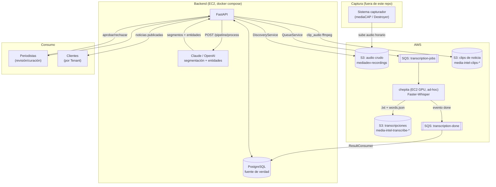
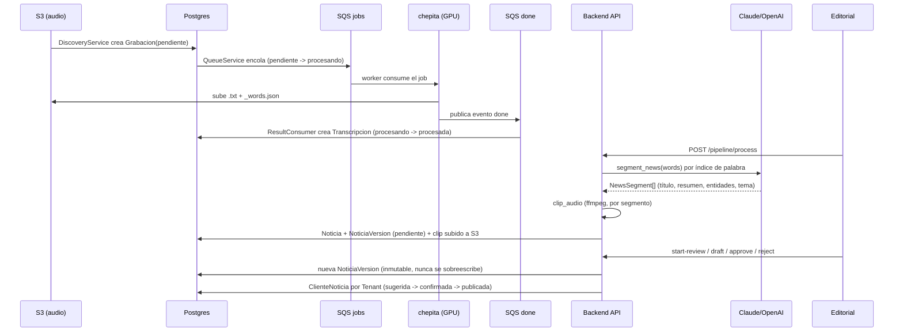
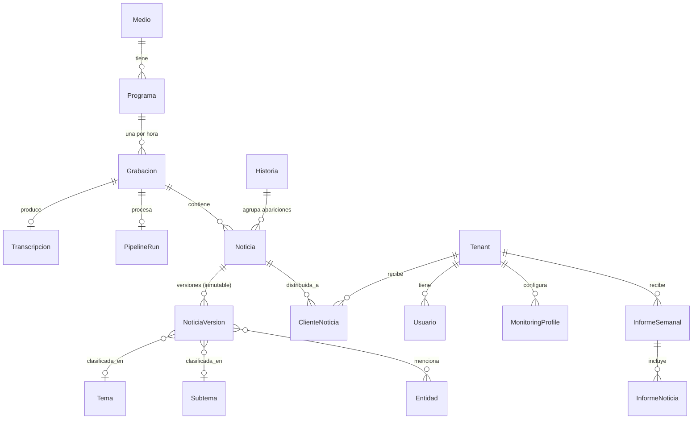

# Media Intelligence Platform

Plataforma de Inteligencia Mediática Asistida por IA (MVP) — AdSignal.

Monitorea radio y TV en Honduras, transcribe el audio con IA, detecta y segmenta noticias automáticamente, y le da a un equipo editorial un flujo de revisión/curación por cliente antes de publicar. Multi-tenant desde el diseño: cada cliente (`Tenant`) ve solo las noticias que le corresponden, curadas por un equipo editorial interno.

Si es tu primera vez en el repo, este documento te da el mapa completo. El detalle de cada pieza vive en [`docs/`](docs/) — este README enlaza a cada doc en el momento en que hace falta.

## Tabla de contenidos

- [Qué hace el sistema](#qué-hace-el-sistema)
- [Arquitectura a alto nivel](#arquitectura-a-alto-nivel)
- [Flujo de datos: de la grabación a la noticia publicada](#flujo-de-datos-de-la-grabación-a-la-noticia-publicada)
- [Modelo de dominio](#modelo-de-dominio)
- [Stack técnico](#stack-técnico)
- [Estructura del repo](#estructura-del-repo)
- [API](#api)
- [Cómo correr esto localmente](#cómo-correr-esto-localmente)
- [Infraestructura AWS (producción)](#infraestructura-aws-producción)
- [Documentación completa](#documentación-completa)
- [Estado actual y limitaciones conocidas](#estado-actual-y-limitaciones-conocidas)

## Qué hace el sistema

1. **Captura** — un sistema externo (fuera de este repo, "mediaCAP"/"Destroyer") graba radio/TV por hora y sube el audio a S3.
2. **Transcripción** — instancias GPU ad-hoc ("chepita", Faster-Whisper) consumen una cola SQS, transcriben, y suben el resultado a S3.
3. **Ingesta** — el backend descubre grabaciones nuevas, encola el trabajo de transcripción, y reconcilia los resultados de vuelta a Postgres.
4. **Segmentación por IA** — un LLM (Claude, con OpenAI como respaldo) detecta noticias individuales dentro de una hora de transmisión continua: título, resumen, entidades, tema, y los tiempos exactos de inicio/fin.
5. **Clipping** — se corta el audio de cada noticia detectada (ffmpeg) y se sube a S3 como un clip independiente.
6. **Revisión editorial** — periodistas confirman/editan/rechazan cada noticia detectada antes de publicarla. Cada edición es inmutable (versionado), nunca se sobreescribe una versión publicada.
7. **Distribución por cliente** — cada `Tenant` (cliente) recibe solo las noticias que un `MonitoringProfile` marcó como relevantes para él, con sentimiento y prioridad editorial.

## Arquitectura a alto nivel



**Puntos clave del diseño:**
- **Postgres es la única fuente de verdad de estado.** S3 solo guarda archivos; nunca se infiere el estado de una grabación leyendo S3 directamente (salvo scripts de reconciliación puntuales, ver [`docs/INGESTION_DESIGN.md`](docs/INGESTION_DESIGN.md)).
- **Chepita nunca tiene credenciales de base de datos** — solo habla SQS + S3. Es infraestructura ad-hoc: se lanza cuando hay backlog, se termina cuando no.
- **Sin bus de eventos dedicado** — las transiciones de estado en Postgres más los mensajes SQS son los únicos "eventos" del sistema.

## Flujo de datos: de la grabación a la noticia publicada



Detalle completo de cada paso, contratos de mensaje SQS, e idempotencia: [`docs/INGESTION_DESIGN.md`](docs/INGESTION_DESIGN.md) y [`docs/ORCHESTRATOR_DESIGN.md`](docs/ORCHESTRATOR_DESIGN.md).

## Modelo de dominio

Nombres de dominio en español a propósito (lenguaje ubicuo del negocio) — solo los términos técnico-operativos sin significado editorial (`PipelineRun`) quedan en inglés.



| Módulo | Entidades principales | Responsabilidad |
|---|---|---|
| `media` | `Medio`, `Programa` | Catálogo de radios/canales monitoreados (global, no por tenant). |
| `recordings` | `Grabacion`, `Transcripcion` | Un archivo de audio por hora + su transcripción. Pipeline de ingesta S3↔Postgres. |
| `transcription` | `TranscriptionProvider`, `FasterWhisperProvider` | Abstracción del proveedor de transcripción (hoy Faster-Whisper en chepita). |
| `pipeline` | `Noticia`, `NoticiaVersion`, `PipelineRun` | Orquesta segmentación + clipping; versiona cada noticia de forma inmutable. |
| `ai` | `Tema`, `Subtema`, `Entidad`, `AIAnalysisProvider` | Catálogo editorial + puerto hacia el LLM (Claude primario, OpenAI respaldo). |
| `editorial` | `Noticia`, `NoticiaVersion`, `Historia`, `ClienteNoticia`, `MonitoringProfile` | Flujo editorial y curación por cliente. `Historia` agrupa la misma noticia cubierta por varias emisoras (dedup semántico) — sin ella, un periodista cura el mismo evento hasta 8 veces. |
| `auth` | `Tenant`, `Usuario`, `LoginEvent` | Multi-tenancy + roles (`super_admin`, `supervisor_editorial`, `periodista`, `admin_cliente`, `usuario_cliente`). |
| `reports` | `InformeSemanal`, `InformeNoticia` | Informes agregados por cliente. |

Todas las tablas por-tenant usan `TenantRequiredMixin` (columna `tenant_id` obligatoria); las de infraestructura compartida (`Medio`, `Grabacion`, etc.) no. Ver [`src/infrastructure/db/base.py`](src/infrastructure/db/base.py).

Detalle completo del dominio editorial (reglas de negocio, estados, permisos): [`docs/EDITORIAL_DOMAIN.md`](docs/EDITORIAL_DOMAIN.md) y [`docs/PRD.md`](docs/PRD.md).

## Stack técnico

- **Backend:** Python 3.12, FastAPI, SQLAlchemy 2.0, Alembic, Pydantic v2.
- **Base de datos:** PostgreSQL 17.
- **IA:** Anthropic Claude (primario), OpenAI (respaldo) para segmentación; Faster-Whisper (GPU) para transcripción.
- **Infraestructura:** AWS (EC2, S3, SQS) administrada manualmente vía AWS CLI/SSM — sin IaC todavía (ver [limitaciones](#estado-actual-y-limitaciones-conocidas)).
- **Despliegue:** Docker Compose (backend + Postgres + nginx) en una sola EC2 para el MVP.
- **Tests:** pytest, contra Postgres real (no mocks de DB) + `MagicMock` para S3/SQS.

## Estructura del repo

```
src/
  api/                  # FastAPI: routers, schemas — capa de transporte, sin lógica de negocio
  application/          # Casos de uso que orquestan varios módulos
  infrastructure/       # DB engine/config/settings, repositorio genérico
  modules/
    media/              # Medio, Programa
    recordings/         # Grabacion, Transcripcion, discovery/queue/consumer S3<->SQS<->Postgres
    transcription/      # TranscriptionProvider (Faster-Whisper), deployado verbatim a chepita
    ai/                 # Tema/Subtema/Entidad + AIAnalysisProvider (Claude/OpenAI)
    pipeline/           # Noticia, NoticiaVersion, PipelineRun, MediaProcessingOrchestrator
    editorial/          # ClienteNoticia, MonitoringProfile, repositorios de curación
    auth/               # Tenant, Usuario, roles (endpoints aún no implementados)
    clients/            # (vacío por ahora — ver editorial para ClienteNoticia)
    reports/            # InformeSemanal, InformeNoticia
  shared/               # Logging, manejo de errores compartido
scripts/                # Scripts operativos (enqueue, consume, backfill, seed) — ver docs/INGESTION_DESIGN.md
alembic/versions/       # Migraciones de schema
tests/                  # pytest, un archivo por feature/módulo
docs/                   # Documentación de arquitectura, dominio, e infraestructura (fuente de verdad)
```

## API

Prefijo común `/api/v1`. Routers activos:

| Router | Prefijo | Endpoints | Estado |
|---|---|---|---|
| `editorial` | `/news` | `GET /dashboard`, `GET /{id}/detail`, `GET /search`, `GET /{id}/clip`, `GET /pending`, `POST /start-review`, `POST /{id}/draft`, `POST /{id}/approve`, `POST /{id}/reject` | Implementado |
| `pipeline` | `/pipeline` | `POST /process` — corre segmentación + clipping sobre una `Grabacion` ya transcrita | Implementado |
| `auth` | `/auth` | — | **Stub**, sin endpoints todavía |
| `clients` | `/clients` | — | **Stub**, sin endpoints todavía |
| `media` | `/media` | — | **Stub**, sin endpoints todavía |

`GET /news/dashboard` es de lectura pública (sin auth de usuario) protegido por `DASHBOARD_TOKEN`, pensado para embeber en el frontend del cliente. Ver [`docs/API.md`](docs/API.md) para el contrato completo request/response de cada endpoint.

## Cómo correr esto localmente

```bash
cp .env.example .env
# completar .env: POSTGRES_PASSWORD, ANTHROPIC_API_KEY (obligatoria),
# OPENAI_API_KEY (opcional, respaldo) -- ver comentarios en .env.example

docker compose up -d postgres        # solo Postgres, para dev con uvicorn local
# o bien, todo el stack:
docker compose up -d                 # backend + postgres + nginx

# migraciones
alembic upgrade head

# seed de medios/programas (necesario antes de correr discovery)
python scripts/seed_medios.py

# correr el backend en dev (recarga en caliente)
uvicorn src.api.main:app --reload

# tests (necesitan Postgres accesible, se saltan solos si no lo esta)
pytest
```

Para producción (EC2 con `docker compose up -d` completo, nginx, deploy vía `git pull` + rebuild): [`docs/DEPLOYMENT.md`](docs/DEPLOYMENT.md).

## Infraestructura AWS (producción)

No hay Terraform/CDK — todo se administra manualmente vía AWS CLI/consola/SSM. Cuenta `050871635829`, región `us-east-1`. Resumen:

- **Backend de producción:** una sola EC2 (`media-intel-mvp-backend`, t3.small) corriendo `docker compose` completo (backend + Postgres + nginx). Es la única instancia que corre 24/7.
- **Transcripción (chepita):** EC2 GPU (`g6.xlarge`, L4) ad-hoc — se lanzan cuando hay backlog, se terminan cuando no. AMI versionado en semver, ver tabla en `docs/INFRASTRUCTURE.md`.
- **Colas SQS:** `media-intel-transcription-jobs` (+ DLQ), `media-intel-transcription-done`.
- **Buckets S3:** audio crudo, transcripciones, clips de noticia (uno por bucket).
- **Acceso remoto:** solo SSM Run Command — no hay SSH abierto por diseño.

Detalle completo, IDs de recursos, proceso de versionado de AMI, e **incidentes conocidos**: [`docs/INFRASTRUCTURE.md`](docs/INFRASTRUCTURE.md).

**Huecos de permisos IAM conocidos** (el usuario `media-intelligence-dev` no los tiene, y no hay ticket para pedirlos todavía): `ec2:RevokeSecurityGroupIngress` (sí tiene `Authorize`, no `Revoke` — asimetría real), `rds:Describe*`, `cloudwatch:GetMetricStatistics`, `ssm:ListCommands`, `sqs:ListQueues`, `pricing:GetProducts`. Si necesitas alguno de estos, vas a tener que pedir el permiso primero en vez de asumir que existe.

## Documentación completa

| Doc | Contenido |
|---|---|
| [`PRD.md`](docs/PRD.md) | Producto: requisitos funcionales, reglas de negocio, estilo arquitectónico. |
| [`ARCHITECTURE.md`](docs/ARCHITECTURE.md) | Documento formal de arquitectura de software (principios, vista de alto nivel). |
| [`ARCHITECTURE_REVIEW.md`](docs/ARCHITECTURE_REVIEW.md) | Revisión crítica de la arquitectura, riesgos identificados y su resolución. |
| [`BACKEND_ARCHITECTURE.md`](docs/BACKEND_ARCHITECTURE.md) | Cómo está organizado el backend puertas adentro: capas, convenciones, naming. |
| [`EDITORIAL_DOMAIN.md`](docs/EDITORIAL_DOMAIN.md) | Dominio editorial en profundidad: estados de `Noticia`, permisos, flujo de curación. |
| [`INGESTION_DESIGN.md`](docs/INGESTION_DESIGN.md) | Pipeline S3↔SQS↔Postgres: discovery, queue, consumers, contratos de mensaje, backfills. |
| [`ORCHESTRATOR_DESIGN.md`](docs/ORCHESTRATOR_DESIGN.md) | `MediaProcessingOrchestrator`: segmentación por IA + clipping, paso a paso. |
| [`TRANSCRIPTION_ARCHITECTURE.md`](docs/TRANSCRIPTION_ARCHITECTURE.md) | `TranscriptionProvider`, Faster-Whisper, contrato del worker de chepita. |
| [`ERROR_HANDLING.md`](docs/ERROR_HANDLING.md) | Clasificación de errores (transitorio/permanente), retries, DLQ. |
| [`INFRASTRUCTURE.md`](docs/INFRASTRUCTURE.md) | Infra AWS real: instancias, colas, buckets, AMIs, incidentes conocidos. |
| [`DEPLOYMENT.md`](docs/DEPLOYMENT.md) | Cómo desplegar/actualizar producción, crontabs, logging. |
| [`API.md`](docs/API.md) | Contrato completo de cada endpoint (request/response). |
| [`OPTIMIZATION_REPORT.md`](docs/OPTIMIZATION_REPORT.md) | Benchmarks de transcripción (batch size, prefetch) que justifican la config actual. |
| [`EFFICIENCY_REVIEW.md`](docs/EFFICIENCY_REVIEW.md) | **Propuestas de mejora priorizadas** (no implementadas): deduplicación entre emisoras, costo de LLM, calidad de transcripción, infra. |

## Estado actual y limitaciones conocidas

- **`auth`/`clients`/`media` son stubs** — los routers existen (prefijo registrado) pero sin endpoints implementados todavía.
- **Sin CI** — nada corre tests/lint automáticamente en un PR; correr `pytest` y `ruff` a mano antes de mergear.
- **Sin IaC** — toda la infraestructura AWS se creó a mano; `docs/INFRASTRUCTURE.md` es la única fuente de verdad de qué existe.
- **Chepita es infraestructura ad-hoc, no un servicio permanente** — no asumas que hay una instancia corriendo; revisar `docs/INFRASTRUCTURE.md` antes de asumir el estado actual.
- **`sentimiento` en `ClienteNoticia` existe en el modelo pero nada lo puebla todavía** — el pipeline de IA hoy hace segmentación (título/resumen/entidades/tema), no clasificación de sentimiento.
