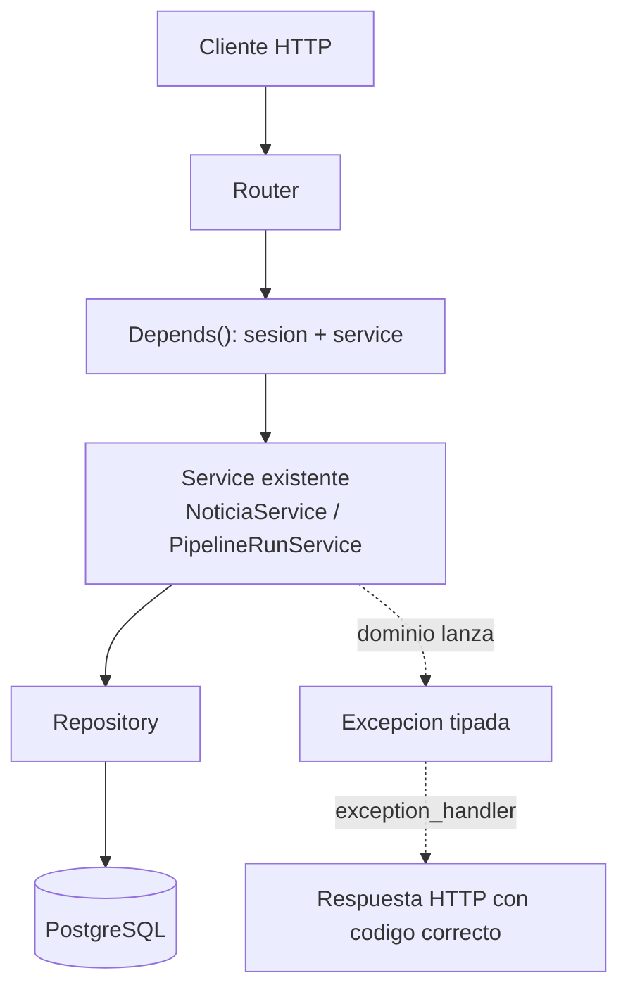

# API.md

API REST que expone el dominio ya construido y probado (`PipelineRunService`, `NoticiaService`) por HTTP. **Capa de transporte pura** — ningún endpoint contiene lógica de negocio; solo valida el request, resuelve dependencias, llama al servicio existente, y devuelve una respuesta. Ver `docs/BACKEND_ARCHITECTURE.md` y `docs/EDITORIAL_DOMAIN.md` para el dominio en sí, que no cambió en esta fase.

Fuera de alcance de esta fase: autenticación, autorización, RBAC, JWT, frontend, websockets, reportes, publicación al cliente, notificaciones, IA adicional.

## Arquitectura

```
HTTP Request
    │
    ▼
Router (src/api/routers/*.py)          -- valida DTO, resuelve Depends(), llama al service
    │
    ▼
Depends() (src/api/deps.py)             -- abre Session, construye repos/services/resolver
    │
    ▼
Service (NoticiaService / PipelineRunService)   -- YA EXISTÍA, sin cambios
    │
    ▼
Repository → PostgreSQL
```



Cada request abre **una sola** `Session` de SQLAlchemy (`get_db_session`, generador con `try/finally`, cerrada siempre al terminar el request — incluso si algo falla). FastAPI cachea el resultado de una dependencia dentro de un mismo request, así que aunque varios `Depends()` del mismo endpoint dependan de `get_db_session`, se abre una sola sesión, no una por dependencia. No hay singletons ni variables globales — cada `Depends()` construye una instancia nueva por request.

## Decisión: `RecordingResolver`

`POST /pipeline/process` solo recibe `recording_id`, pero `PipelineRunService.run()` necesita rutas de archivo (`words_json_path`, `audio_path`, `output_dir`) — la integración con S3 real todavía no existe (`docs/BACKEND_ARCHITECTURE.md`). Para no inventar lógica de negocio dentro del router ni cambiar la firma de `PipelineRunService.run()`, se introdujo un puerto nuevo:

```python
# src/modules/pipeline/resolvers.py
class RecordingResolver(ABC):
    def resolve(self, recording_id: UUID) -> RecordingResources: ...
```

`LocalFileRecordingResolver` es la implementación de esta fase: busca `{s3_key aplanado}.mp3` y `{...}_words.json` en `settings.local_media_dir` (default `./data/recordings`). Si no existen, lanza `RecursosNoDisponibles` (409). `PipelineRunService` y `MediaProcessingOrchestrator` **no conocen este resolver** — el router lo llama antes de construir el `ProcessAudioJob`, y le pasa las rutas ya resueltas. Cuando exista integración real con S3, la migración es un `S3RecordingResolver` nuevo que descargue a un directorio temporal y devuelva las mismas rutas locales; nada más cambia.

## Endpoints

### `POST /api/v1/pipeline/process`

Ejecuta `PipelineRunService.run()` sobre una grabación ya transcrita.

**Request**
```json
{ "recording_id": "019f7231-4a67-7141-9a06-62071cdf60b3" }
```

**Response `200`**
```json
{
  "pipeline_run_id": "0198...",
  "status": "completado",
  "news_generated": 2
}
```

| Código | Causa |
|---|---|
| `200` | Éxito |
| `404` | `recording_id` no existe (`GrabacionNoEncontrada`) |
| `409` | La grabación existe pero `words.json`/audio no están disponibles todavía (`RecursosNoDisponibles`) |
| `422` | `recording_id` no es un UUID válido |

### `GET /api/v1/news/pending`

Lista, en orden FIFO, las noticias `PENDIENTE` — **no** pasa por `NoticiaService` (ver nota abajo).

**Response `200`**
```json
[
  { "id": "0198...", "status": "pendiente", "title": "Accidente en la carretera del norte", "created_at": "2026-07-19T22:14:00Z" }
]
```

> **Nota de diseño:** este endpoint no llama a `NoticiaService` porque listar no es una operación de negocio — no muta nada ni aplica ninguna regla. `NoticiaService.siguiente_pendiente_con_lock()` tampoco sirve para esto: usa `SELECT FOR UPDATE`, y usarlo para listar bloquearía filas solo por mostrarlas. El router llama directo a `NoticiaRepository.listar_pendientes()` (lectura pura), inyectado por su cuenta — la única excepción a "todo pasa por el service" en toda esta fase, y es deliberada.

### `POST /api/v1/news/start-review`

Ejecuta `NoticiaService.start_review(editor_id)`.

**Request**
```json
{ "editor_id": "0198...-editor" }
```

**Response `200`** (noticia asignada) — ver `NewsResponse` abajo.
**Response `204`** — cola vacía (`ColaVacia`), sin body.

### `POST /api/v1/news/{news_id}/draft`

Ejecuta `NoticiaService.save_draft()`.

**Request**
```json
{
  "editor_id": "0198...-editor",
  "title": "Título corregido",
  "summary": "Resumen corregido",
  "transcription_text": null
}
```

Campos `title`/`summary`/`transcription_text` opcionales (edición parcial — heredan de la versión anterior si se omiten, igual que el dominio). **`editor_id` es obligatorio** — ver nota abajo.

**Response `200`**
```json
{
  "news_id": "0198...",
  "version_number": 2,
  "title": "Título corregido",
  "summary": "Resumen corregido",
  "transcription_text": "...",
  "is_ai_generated": false,
  "edited_by": "0198...-editor",
  "created_at": "2026-07-19T22:20:00Z"
}
```

### `POST /api/v1/news/{news_id}/approve`

Ejecuta `NoticiaService.approve(news_id, editor_id)`. Body: `{ "editor_id": "..." }`.

### `POST /api/v1/news/{news_id}/reject`

Ejecuta `NoticiaService.reject(news_id, editor_id, motivo)`. Body: `{ "editor_id": "...", "reason": "..." }`.

### Nota importante: `editor_id` en `draft`/`approve`/`reject`

El pedido original mostraba estos tres bodies sin `editor_id` (solo `start-review` lo incluía). Pero `save_draft`/`approve`/`reject` en el dominio **requieren** `editor_id` para verificar el bloqueo (FR-051 — "solo el periodista que tiene la noticia asignada puede editarla/aprobarla/rechazarla"), y esta fase explícitamente no implementa autenticación, así que no hay otra forma de saber quién está llamando. Se agregó `editor_id` a los tres bodies — es la única forma de que estos endpoints funcionen correctamente contra las reglas ya construidas y probadas en `NoticiaService`, sin inventar lógica nueva ni tocar el dominio. Cuando se implemente auth (fase futura), `editor_id` se reemplaza por el usuario autenticado y desaparece del body.

También se detectó que el body de ejemplo de `draft` incluía un campo `content` sin equivalente en `NoticiaVersion` (que tiene `titulo`/`resumen`/`transcripcion_texto`, no un campo genérico "contenido"). No se agregó al modelo de datos (fuera de alcance — "no cambiar el modelo de datos"); el DTO usa `title`/`summary`/`transcription_text`, que sí mapean 1:1.

### `NewsResponse` (respuesta común de `start-review`/`approve`/`reject`)

```json
{
  "id": "0198...",
  "status": "en_revision",
  "assigned_to": "0198...-editor",
  "clip_start_seconds": 26.8,
  "clip_end_seconds": 43.98,
  "title": "Accidente en la carretera del norte",
  "summary": "..."
}
```

`title`/`summary` se leen de la `NoticiaVersion` actual (`version_actual_id`) — nunca se devuelve la entidad `Noticia`/`NoticiaVersion` directamente, siempre pasa por este DTO.

## Mapeo de errores de dominio → HTTP

Registrado en `src/api/main.py` vía `@app.exception_handler(...)` — el router nunca hace `try/except`, las excepciones del dominio se propagan solas hasta este nivel:

| Excepción de dominio | HTTP |
|---|---|
| `ColaVacia` | `204 No Content` (sin body) |
| `NoticiaNoEncontrada` | `404` |
| `GrabacionNoEncontrada` | `404` |
| `NoticiaNoBloqueadaPorEditor` | `409 Conflict` |
| `RecursosNoDisponibles` | `409 Conflict` |
| Pydantic `ValidationError` (body malformado) | `422` — manejo nativo de FastAPI, sin código propio |
| Cualquier otra excepción no prevista | `500`, logueada completa server-side (JSON estructurado, `src/shared/logging_utils.py`) — **nunca se devuelve el traceback al cliente** |

## OpenAPI / Swagger

Todos los endpoints tienen `tags`, `summary`, `description`, `response_model` y `status_code` explícitos. Disponible en `/docs` (Swagger UI) y `/redoc` una vez la app está corriendo (`uvicorn src.api.main:app`).

## Tests

`tests/test_api_pipeline.py` (4 tests) y `tests/test_api_editorial.py` (7 tests) — `TestClient` contra la app real, PostgreSQL real (docker-compose local), sin mocks. `test_api_pipeline.py` además usa OpenAI real + ffmpeg real para el camino de éxito (coloca `words.json`+audio sintético en la ruta que `LocalFileRecordingResolver` espera). Cubren: éxito, `404`, `409` (por bloqueo y por recursos faltantes), `422`, y cola vacía (`204`). Cada test limpia las filas/archivos que crea — verificado que la base y el disco quedan en el mismo estado en el que empezaron.

Total del proyecto tras esta fase: **44 tests pasando** (33 de fases anteriores + 11 de la API).
