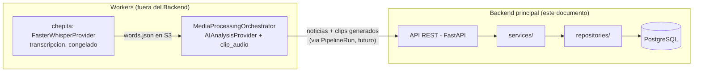
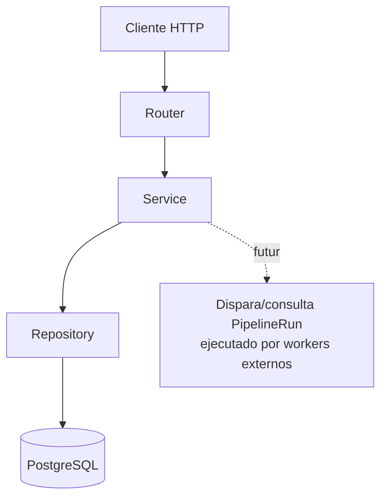

# BACKEND_ARCHITECTURE.md

Diseño de la estructura del Backend principal de Media Intelligence Platform. **Solo estructura — sin lógica de negocio, sin conexión real a PostgreSQL, sin endpoints implementados.** Chepita (worker de transcripción) queda congelado; todo el desarrollo nuevo descrito aquí ocurre en este backend.

## Nota de naming — importante, léela antes de usar los modelos

El PRD (`docs/PRD.md`) define el lenguaje ubicuo del dominio en **español** (Noticia, Medio, Programa, Grabación) y ya existen modelos SQLAlchemy reales para eso, con migraciones ya generadas (`alembic/versions/0001_initial_schema.py`). Este pedido nombró los modelos en inglés (`News`, `NewsVersion`, `MediaSource`, `Program`) — **no se crearon clases nuevas duplicadas**. El mapeo es:

| Nombre pedido | Modelo real (ya existente) | Ubicación |
|---|---|---|
| `News` | `Noticia` | `src/modules/editorial/models.py` |
| `NewsVersion` | `NoticiaVersion` | `src/modules/editorial/models.py` |
| `MediaSource` | `Medio` | `src/modules/media/models.py` |
| `Program` | `Programa` | `src/modules/media/models.py` |
| `PipelineRun` | `PipelineRun` (nuevo, sin equivalente previo) | `src/modules/pipeline/models.py` |

`PipelineRun` sí se creó en inglés tal como se pidió — es un registro técnico-operativo (una fila por ejecución del pipeline de IA), no un término que el equipo editorial use en español, así que no encajaba forzarlo al lenguaje ubicuo del PRD. Si esto no era lo que se quería (ej. preferir renombrar `Noticia`→`News` en todo el codebase), avisar antes de que se construya más lógica encima — revertirlo después sería costoso.

También: `Tenant` (el modelo real detrás de "Clientes") vive en `src/modules/auth/models.py`, no en `src/modules/clients/` — decisión de antes de esta sesión, ya reflejada en la migración inicial. El módulo `clients` administra su ciclo de vida importándolo desde ahí (ver `src/modules/clients/repositories.py`). No se movió para no invalidar la migración existente.

## Responsabilidades del Backend

Administra: Pipeline Runs, News/NewsVersion, Media Sources, Programas, Clientes, Usuarios, Editorial. Expone API REST.

**No hace:** transcripción (chepita), IA/segmentación (el orquestador + `AIAnalysisProvider`), FFmpeg/clipping (el orquestador + `clip_audio`). El backend es la pieza que **sabe qué pasó y lo administra**, no la que ejecuta el pipeline pesado.

## Límite entre Backend y Workers



El Backend no importa `FasterWhisperProvider` ni llama `pipeline.transcribe()`, ni importa `clip_audio`/ffmpeg. Sí puede (en una fase futura) importar los **modelos de datos compartidos** de transcripción (`Word`, `TranscriptionResult` en `src/modules/transcription/models/`) si necesita leer un `words.json` para mostrar contexto — leer el contrato no es lo mismo que ejecutar el motor. Por ahora ni eso: en esta fase el Backend no toca `transcription/` en absoluto.

`PipelineRun` es el registro que en el futuro va a conectar ambos lados: el Backend crea una fila `PENDIENTE` antes de disparar un run, algo (todavía sin decidir cómo — no es parte de esta fase) la actualiza a `COMPLETADO`/`ERROR` cuando el worker termina. Por ahora el modelo solo existe, sin ese flujo implementado.

## Estructura de carpetas

Se extendió el modular-monolith ya establecido en `docs/ARCHITECTURE.md` (no se reemplazó por una estructura plana) — cada módulo de dominio ahora tiene, además de `models.py`, las capas `repositories.py` y `services.py`:

```
src/
├── api/
│   ├── main.py              -- app FastAPI, /health, incluye routers vacios
│   └── routers/              -- un router por modulo, sin rutas de negocio todavia
│       ├── auth.py
│       ├── clients.py
│       ├── editorial.py
│       ├── media.py
│       └── pipeline.py
│
├── application/
│   └── orchestrator.py       -- MediaProcessingOrchestrator (ya existia, no es parte del Backend)
│
├── infrastructure/
│   ├── config.py              -- Settings (ya existia)
│   └── db/
│       ├── base.py             -- Base, mixins (ya existia)
│       ├── engine.py            -- get_engine/get_session (ya existia, no conectado activamente en esta fase)
│       ├── registry.py           -- importa todos los modelos para Alembic
│       └── repository.py          -- NUEVO: Repository[T] generico
│
├── modules/
│   ├── auth/         (Usuarios)       -- models.py (existia) + repositories.py + services.py (NUEVO)
│   ├── clients/      (Clientes)        -- repositories.py + services.py (NUEVO, sin models.py propio -- ver nota de naming)
│   ├── editorial/    (News/NewsVersion) -- models.py (existia) + repositories.py + services.py (NUEVO)
│   ├── media/        (MediaSource/Program) -- models.py (existia) + repositories.py + services.py (NUEVO)
│   ├── pipeline/     (PipelineRun)      -- NUEVO: models.py + repositories.py + services.py
│   │
│   ├── ai/            -- ya existia (segmentacion), el Backend no lo ejecuta
│   ├── recordings/    -- ya existia (Grabacion/Transcripcion), sin cambios en esta fase
│   ├── reports/       -- ya existia, fuera de alcance de esta fase
│   └── transcription/ -- CONGELADO, no tocar (chepita)
│
└── shared/
    ├── audit.py, errors.py, error_context.py, logging_utils.py  -- ya existian
```

## Módulos y sus capas

Cada módulo de dominio sigue el mismo patrón de tres capas (Ports & Adapters aplicado dentro del módulo):

```
API (routers)  →  Service (application, orquesta reglas de negocio)  →  Repository (infra, acceso a datos)  →  Model (SQLAlchemy)
```

- **`repositories.py`**: subclases de `Repository[T]` (nuevo, `src/infrastructure/db/repository.py`) — CRUD genérico (`get_by_id`, `list`, `add`, `commit`) ya funcional (es infraestructura, no lógica de negocio). Consultas específicas de negocio (filtros por tenant, por estado, etc.) se agregan en la siguiente fase.
- **`services.py`**: una clase por módulo, con el/los repositorios inyectados por constructor. Sin métodos de negocio todavía — son el punto de extensión donde la próxima fase agrega las reglas (ej. `NoticiaService.aprobar(...)`, `PipelineRunService.iniciar(...)`).
- **`models.py`**: ya existían para auth/editorial/media (con migraciones generadas); `pipeline/models.py` es nuevo en esta fase.

| Módulo | Modelo(s) | Repository | Service |
|---|---|---|---|
| `pipeline` | `PipelineRun` | `PipelineRunRepository` | `PipelineRunService` |
| `editorial` | `Noticia`, `NoticiaVersion` (+ lo demás que ya existía) | `NoticiaRepository`, `NoticiaVersionRepository` | `NoticiaService` |
| `media` | `Medio`, `Programa` | `MedioRepository`, `ProgramaRepository` | `MediaService` |
| `clients` | `Tenant` (importado desde `auth`) | `TenantRepository` | `ClienteService` |
| `auth` | `Usuario` (+ `Tenant`, `LoginEvent`) | `UsuarioRepository` | `UsuarioService` |

## Modelo `PipelineRun`

```python
class PipelineRun(Base, UUIDPrimaryKeyMixin, TimestampMixin):
    __tablename__ = "pipeline_runs"

    grabacion_id: UUID          # FK -> grabaciones.id
    estado: EstadoPipelineRun    # pendiente | en_progreso | completado | error
    iniciado_at: datetime | None
    finalizado_at: datetime | None
    noticias_generadas: int
    error_mensaje: str | None
```

Una fila por intento de ejecutar el pipeline completo (transcripción → segmentación → clipping) sobre una `Grabacion`. Deliberadamente **no** tiene todavía relación hacia `Noticia` (no se agregó `pipeline_run_id` a la tabla `noticias` existente) — modificar una tabla ya migrada es más que "estructura", se deja para cuando se implemente el flujo real de creación de noticias desde un run.

Verificado: el modelo registra correctamente en `Base.metadata` junto a las 19 tablas ya existentes (`python -c "from src.infrastructure.db.registry import Base; print(Base.metadata.tables.keys())"` → incluye `pipeline_runs`). No se corrió ninguna migración de Alembic ni se conectó a PostgreSQL — eso es explícitamente la siguiente fase.

## API (FastAPI)

`src/api/main.py` — la app existe y arranca (verificado con `TestClient`, `GET /health` → `200 {"status": "ok"}`), con un router vacío por módulo ya incluido (`/auth`, `/clients`, `/news`, `/media`, `/pipeline-runs`) — listos para que la siguiente fase les agregue rutas, sin tener que tocar `main.py` de nuevo. Ningún endpoint de negocio implementado todavía, tal como se pidió.

## Flujo (una vez implementado — no en esta fase)



## Qué falta explícitamente para la siguiente fase

- Conectar `get_session()` a los repositorios vía dependency injection de FastAPI (`Depends`).
- Lógica real en cada `Service` (reglas de negocio, validaciones, versión de `NoticiaVersion` al editar, etc.).
- Endpoints reales en cada router.
- Decidir y construir el flujo real que crea/actualiza un `PipelineRun` (¿el Backend dispara el run? ¿solo lo registra después de que otro sistema lo hizo?) — deliberadamente sin resolver en esta fase.
- Conectar PostgreSQL de verdad (correr `alembic upgrade head` contra una base real, no solo local de desarrollo).
