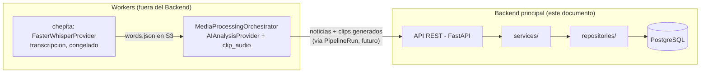
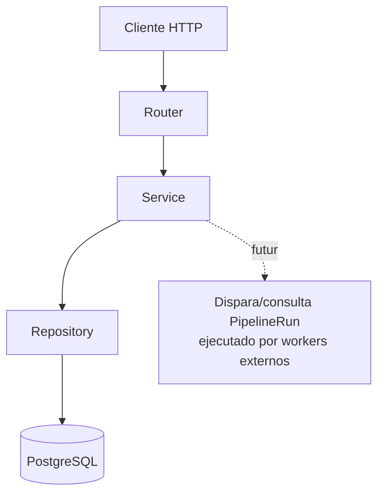

# BACKEND_ARCHITECTURE.md

Diseño de la estructura del Backend principal de Media Intelligence Platform. **Solo estructura — sin lógica de negocio, sin conexión real a PostgreSQL, sin endpoints implementados.** Chepita (worker de transcripción) queda congelado; todo el desarrollo nuevo descrito aquí ocurre en este backend.

## Nota de naming — importante, léela antes de usar los modelos

El PRD (`docs/PRD.md`) define el lenguaje ubicuo del dominio en **español** (Noticia, Medio, Programa, Grabación) y ya existen modelos SQLAlchemy reales para eso, con migraciones ya generadas (`alembic/versions/0001_initial_schema.py`). Este pedido nombró los modelos en inglés (`News`, `NewsVersion`, `MediaSource`, `Program`) — **no se crearon clases nuevas duplicadas**. El mapeo es:

| Nombre pedido | Modelo real (ya existente) | Ubicación |
|---|---|---|
| `News` | `Noticia` | `src/modules/editorial/models.py` |
| `NewsVersion` | `NoticiaVersion` | `src/modules/editorial/models.py` |
| `MediaSource` | `Medio` | `src/modules/media/models.py` |
| `Program` | `Programa` | `src/modules/media/models.py` |
| `PipelineRun` | `PipelineRun` (nuevo, sin equivalente previo) | `src/modules/pipeline/models.py` |

`PipelineRun` sí se creó en inglés tal como se pidió — es un registro técnico-operativo (una fila por ejecución del pipeline de IA), no un término que el equipo editorial use en español, así que no encajaba forzarlo al lenguaje ubicuo del PRD. Si esto no era lo que se quería (ej. preferir renombrar `Noticia`→`News` en todo el codebase), avisar antes de que se construya más lógica encima — revertirlo después sería costoso.

También: `Tenant` (el modelo real detrás de "Clientes") vive en `src/modules/auth/models.py`, no en `src/modules/clients/` — decisión de antes de esta sesión, ya reflejada en la migración inicial. El módulo `clients` administra su ciclo de vida importándolo desde ahí (ver `src/modules/clients/repositories.py`). No se movió para no invalidar la migración existente.

## Responsabilidades del Backend

Administra: Pipeline Runs, News/NewsVersion, Media Sources, Programas, Clientes, Usuarios, Editorial. Expone API REST.

**No hace:** transcripción (chepita), IA/segmentación (el orquestador + `AIAnalysisProvider`), FFmpeg/clipping (el orquestador + `clip_audio`). El backend es la pieza que **sabe qué pasó y lo administra**, no la que ejecuta el pipeline pesado.

## Límite entre Backend y Workers



El Backend no importa `FasterWhisperProvider` ni llama `pipeline.transcribe()`, ni importa `clip_audio`/ffmpeg. Sí puede (en una fase futura) importar los **modelos de datos compartidos** de transcripción (`Word`, `TranscriptionResult` en `src/modules/transcription/models/`) si necesita leer un `words.json` para mostrar contexto — leer el contrato no es lo mismo que ejecutar el motor. Por ahora ni eso: en esta fase el Backend no toca `transcription/` en absoluto.

`PipelineRun` es el registro que en el futuro va a conectar ambos lados: el Backend crea una fila `PENDIENTE` antes de disparar un run, algo (todavía sin decidir cómo — no es parte de esta fase) la actualiza a `COMPLETADO`/`ERROR` cuando el worker termina. Por ahora el modelo solo existe, sin ese flujo implementado.

## Estructura de carpetas

Se extendió el modular-monolith ya establecido en `docs/ARCHITECTURE.md` (no se reemplazó por una estructura plana) — cada módulo de dominio ahora tiene, además de `models.py`, las capas `repositories.py` y `services.py`:

```
src/
├── api/
│   ├── main.py              -- app FastAPI, /health, incluye routers vacios
│   └── routers/              -- un router por modulo, sin rutas de negocio todavia
│       ├── auth.py
│       ├── clients.py
│       ├── editorial.py
│       ├── media.py
│       └── pipeline.py
│
├── application/
│   └── orchestrator.py       -- MediaProcessingOrchestrator (ya existia, no es parte del Backend)
│
├── infrastructure/
│   ├── config.py              -- Settings (ya existia)
│   └── db/
│       ├── base.py             -- Base, mixins (ya existia)
│       ├── engine.py            -- get_engine/get_session (ya existia, no conectado activamente en esta fase)
│       ├── registry.py           -- importa todos los modelos para Alembic
│       └── repository.py          -- NUEVO: Repository[T] generico
│
├── modules/
│   ├── auth/         (Usuarios)       -- models.py (existia) + repositories.py + services.py (NUEVO)
│   ├── clients/      (Clientes)        -- repositories.py + services.py (NUEVO, sin models.py propio -- ver nota de naming)
│   ├── editorial/    (News/NewsVersion) -- models.py (existia) + repositories.py + services.py (NUEVO)
│   ├── media/        (MediaSource/Program) -- models.py (existia) + repositories.py + services.py (NUEVO)
│   ├── pipeline/     (PipelineRun)      -- NUEVO: models.py + repositories.py + services.py
│   │
│   ├── ai/            -- ya existia (segmentacion), el Backend no lo ejecuta
│   ├── recordings/    -- ya existia (Grabacion/Transcripcion), sin cambios en esta fase
│   ├── reports/       -- ya existia, fuera de alcance de esta fase
│   └── transcription/ -- CONGELADO, no tocar (chepita)
│
└── shared/
    ├── audit.py, errors.py, error_context.py, logging_utils.py  -- ya existian
```

## Módulos y sus capas

Cada módulo de dominio sigue el mismo patrón de tres capas (Ports & Adapters aplicado dentro del módulo):

```
API (routers)  →  Service (application, orquesta reglas de negocio)  →  Repository (infra, acceso a datos)  →  Model (SQLAlchemy)
```

- **`repositories.py`**: subclases de `Repository[T]` (nuevo, `src/infrastructure/db/repository.py`) — CRUD genérico (`get_by_id`, `list`, `add`, `commit`) ya funcional (es infraestructura, no lógica de negocio). Consultas específicas de negocio (filtros por tenant, por estado, etc.) se agregan en la siguiente fase.
- **`services.py`**: una clase por módulo, con el/los repositorios inyectados por constructor. `PipelineRunService` ya tiene lógica real (ver abajo); el resto (`NoticiaService`, `MediaService`, `ClienteService`, `UsuarioService`) sigue siendo un stub — punto de extensión para cuando se implemente cada módulo.
- **`models.py`**: ya existían para auth/editorial/media (con migraciones generadas); `pipeline/models.py` es nuevo, migrado en esta fase (`alembic/versions/f142223dde8b_*.py`).

| Módulo | Modelo(s) | Repository | Service |
|---|---|---|---|
| `pipeline` | `PipelineRun` | `PipelineRunRepository` | `PipelineRunService` — **implementado**, ver abajo |
| `editorial` | `Noticia`, `NoticiaVersion` (+ lo demás que ya existía) | `NoticiaRepository`, `NoticiaVersionRepository` | `NoticiaService` — stub |
| `media` | `Medio`, `Programa` | `MedioRepository`, `ProgramaRepository` | `MediaService` — stub |
| `clients` | `Tenant` (importado desde `auth`) | `TenantRepository` | `ClienteService` — stub |
| `auth` | `Usuario` (+ `Tenant`, `LoginEvent`) | `UsuarioRepository` | `UsuarioService` — stub |

## Modelo `PipelineRun`

```python
class PipelineRun(Base, UUIDPrimaryKeyMixin, TimestampMixin):
    __tablename__ = "pipeline_runs"

    grabacion_id: UUID           # FK -> grabaciones.id
    estado: EstadoPipelineRun     # pendiente | en_progreso | completado | error
    iniciado_at: datetime | None
    finalizado_at: datetime | None
    noticias_generadas: int
    error_mensaje: str | None
    metadatos: dict               # JSONB -- padding_seconds, rutas de clips, segmentos detectados
```

Una fila por intento de ejecutar el pipeline completo (transcripción → segmentación → clipping) sobre una `Grabacion`. `Noticia` ahora tiene `pipeline_run_id` (nullable, FK → `pipeline_runs.id`) — agregado en esta fase junto con la tabla `pipeline_runs` (migración `f142223dde8b`), aplicada contra PostgreSQL real (docker-compose local, no una base mock).

## `PipelineRunService.run()` — persistencia real, validada contra PostgreSQL real

```python
def run(self, grabacion_id: uuid.UUID, job: ProcessAudioJob) -> PipelineRun: ...
```

Flujo:
1. Crea `PipelineRun(estado=EN_PROGRESO, iniciado_at=now())` y lo **commitea de inmediato** — marca durable de que el run empezó, incluso si el proceso se cae después (NFR-012: trazabilidad de tareas asíncronas).
2. Llama `MediaProcessingOrchestrator.process_audio(job)` **sin modificarlo** — el orquestador sigue siendo el mismo, agnóstico de base de datos, validado en fases anteriores.
3. Por cada `ProcessedNews` devuelto: crea `Noticia` (con `pipeline_run_id` y `grabacion_id`) + `NoticiaVersion` inicial (`es_generada_por_ia=True`, `numero_version=1`), y enlaza `Noticia.version_actual_id`.
4. Si todo sale bien: actualiza el `PipelineRun` a `COMPLETADO` con `noticias_generadas`, `finalizado_at`, y `metadatos` (padding usado, rutas de los clips generados, título+confianza de cada segmento detectado) — y **un solo commit** para todo el paso 3+4 (atómico: o se persisten todas las noticias de ese run junto con el estado final, o ninguna).
5. Si algo falla: `rollback()` de lo pendiente (noticias a medias no quedan), y el `PipelineRun` (ya persistente desde el paso 1) se actualiza a `ERROR` con `error_mensaje`, en su propio commit.

`resumen` y `transcripcion_texto` de `NoticiaVersion` quedan vacíos a propósito — llenarlos es responsabilidad del módulo Editorial, explícitamente fuera de alcance de esta fase (que solo valida que la persistencia del pipeline funcione de punta a punta, no el contenido editorial).

**Validado end-to-end contra PostgreSQL real** (no mock, no SQLite): `tests/test_pipeline_run_service_e2e.py`, con OpenAI real + ffmpeg real + el fixture ya usado en sesiones anteriores (149 palabras, 2 noticias reales). Resultado: `PipelineRun` queda `COMPLETADO` con `noticias_generadas=2`, se crean 2 filas `Noticia` con `pipeline_run_id` correctamente enlazado, cada una con su `NoticiaVersion` (`numero_version=1`, `es_generada_por_ia=True`) y `version_actual_id` apuntando de vuelta correctamente. El test limpia sus propias filas al terminar (no deja basura en la base real).

**Nota de proceso:** al generar la migración con `alembic revision --autogenerate`, además del cambio esperado (`pipeline_runs` + `noticias.pipeline_run_id`) aparecieron ~15 índices faltantes en columnas FK de otras tablas (`tenant_id`, `grabacion_id`, etc.) que ya estaban declaradas `index=True` en los modelos pero nunca se habían migrado — drift preexistente de antes de esta sesión. Se incluyeron en la misma migración porque son puramente aditivas (no borran ni modifican nada existente) y alinean la base real con modelos que ya estaban en el código.

Migración aplicada contra PostgreSQL real (`alembic upgrade head`, docker-compose local en `localhost:5433`) — ver `alembic/versions/f142223dde8b_*.py`.

## API (FastAPI)

`src/api/main.py` — la app existe y arranca (verificado con `TestClient`, `GET /health` → `200 {"status": "ok"}`), con un router vacío por módulo ya incluido (`/auth`, `/clients`, `/news`, `/media`, `/pipeline-runs`) — listos para que la siguiente fase les agregue rutas, sin tener que tocar `main.py` de nuevo. Ningún endpoint de negocio implementado todavía, tal como se pidió.

## Flujo (una vez implementado — no en esta fase)



## Qué falta explícitamente para la siguiente fase

Ya resuelto en esta fase (dejado aquí tachado, no borrado, para que quede el historial de qué cambió):

- ~~Conectar PostgreSQL de verdad~~ — hecho, `alembic upgrade head` contra docker-compose local real.
- ~~Hacer que `PipelineRunService` persista `PipelineRun`/`Noticia`/`NoticiaVersion`~~ — hecho e implementado, validado end-to-end con OpenAI + ffmpeg reales.

Pendiente:

- Conectar `get_session()` a los repositorios vía dependency injection de FastAPI (`Depends`) — hoy `PipelineRunService` se instancia a mano en el test, no desde un endpoint.
- Módulo **Editorial**: es el siguiente en la lista según lo acordado — lógica real en `NoticiaService` (cola de trabajo, aprobación, versionado al editar, llenar `resumen`/`transcripcion_texto`).
- Lógica real en el resto de `Service` stubs (`MediaService`, `ClienteService`, `UsuarioService`).
- Endpoints reales en cada router.
- Decidir quién dispara un `PipelineRun` en producción (¿el Backend lo inicia? ¿solo lo registra después de que otro sistema — S3 event, cron — lo hizo?) — deliberadamente sin resolver todavía.
- `ProcessAudioJob` sigue esperando archivos locales (`words_json_path`, `audio_path`) — todavía no hay integración con S3 real para que el Backend descargue automáticamente lo que produce chepita.
