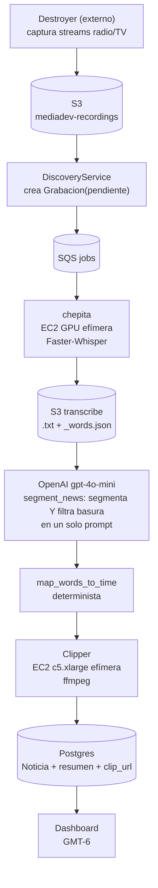
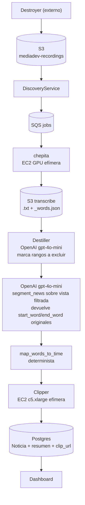
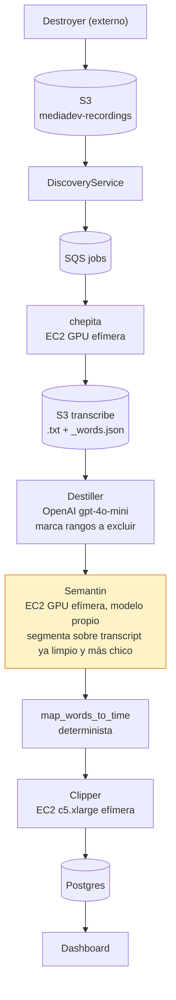

# Propuesta: Destiller + segmentación (Pipeline A vs Pipeline B)

Estado (2026-08-02): **implementado y medido, NO conectado al pipeline.** Destiller clasifica; la política de exclusión existe pero está desconectada a propósito hasta terminar la validación humana. Detalle de infra (AMIs, tipos de instancia, comandos) en [PIPELINE.md](PIPELINE.md) e [INFRASTRUCTURE.md](INFRASTRUCTURE.md).

> **El objetivo del proyecto cambió, y conviene leerlo antes que nada.**
> Destiller ya **no se justifica por ahorrar tokens**. Se justifica por **mejorar la calidad del pipeline y reducir el riesgo de perder noticias**. El ahorro es un efecto secundario.
>
> El cambio no es retórico: sale de una medición. Destilar con dos o tres modelos cuesta ~$0.017–0.043 por grabación y le ahorra a Semantin tokens por un valor de ~$0.004–0.010. **Como argumento de ahorro, no cierra.** Como argumento de precisión, sí — y además es el único que le importa al cliente. Ver [Hallazgos experimentales](#hallazgos-experimentales).

## Hallazgos experimentales

Solo conclusiones respaldadas por medición, cada una con el dato que la sostiene. Medido sobre **20 grabaciones** (una por medio, repartidas en 6 franjas horarias GMT-6), **77,006 palabras comparables**, con **3 modelos**: Qwen2.5-7B-Instruct (GPU propia), gpt-4o-mini y gpt-5-mini.

### 1. La confianza que un modelo declara sobre sí mismo no discrimina

Qwen reporta **0.94** de confianza media cuando coincide con los otros dos modelos y **0.92** cuando queda solo contra ambos. En los bloques que marca `promo`: **0.898** cuando los otros coinciden, **0.885** cuando discrepan.

Un aparente contraste inicial (0.79 vs 0.58) resultó ser un artefacto: los bloques `desconocido` tienen confianza 0 por construcción del código de reparación, y están 2.3x sobre-representados en el grupo de desacuerdo. Descontándolos, la diferencia desaparece.

**Consecuencia:** la pregunta abierta original del diseño —"¿el umbral es 0.85 o 0.9?"— tiene respuesta, y es **ninguno**. Un umbral de confianza no separa los aciertos de los errores.

### 2. El consenso entre modelos sí discrimina

Porcentaje del aire que se excluiría según la regla:

| regla | aire excluido |
|---|---|
| un solo modelo | 29–36% |
| acuerdo de 2 | 22–28% |
| unanimidad de 3 | 19.3% |

Los ~10-17 puntos de diferencia entre "un modelo" y "unanimidad" **son exactamente la zona en disputa**, o sea donde puede haber periodismo.

**El umbral no es un número, es una regla de consenso.**

### 3. El hash textual exacto no sirve para detectar contenido repetido

`repeated_content.py` supone que un spot se transcribe casi idéntico cada vez. Medido sobre **120 horas de una sola emisora**, con ventana de 50 palabras: de 16,077 huellas, solo **57 (0.36%)** aparecen en 2+ grabaciones, y la más repetida aparece en 5. Acortando la ventana a 10 palabras sube a 4.23% — lo que confirma el mecanismo: **una sola palabra distinta rompe el hash de 50**, y Whisper no transcribe igual dos veces.

De los 260 bloques en disputa entre modelos, **cero** se detectan por huella (y el 55% ni siquiera llega a las 50 palabras mínimas).

**Consecuencia:** la detección de contenido recurrente necesita huella **acústica** o similitud difusa. El hash exacto sobre texto de Whisper no es una herramienta viable a esta escala.

### 4. La principal fuente de desacuerdo es noticia vs relleno

Uso de `relleno` por modelo: gpt-4o-mini **12.6%** del aire, gpt-5-mini 2.4%, Qwen 1.3%. La mayor diferencia individual de todo el benchmark es `noticia → relleno`, **5,467 palabras**.

Y los tres modelos **nunca** coinciden en `relleno`: **0.0%** del aire en unanimidad.

**Consecuencia:** `relleno` quedó fuera de las categorías excluibles. Era el mayor riesgo de perder periodismo y no aportaba exclusión.

### 5. El desacuerdo no es repetitivo

260 bloques en disputa agrupan en **187 clusters**, de los cuales solo **13 tienen 3+ bloques**. Hay **174 casos aislados**.

**Consecuencia:** no existen "10 o 15 tipos de discrepancia" que resolver de una vez. Los patrones que sí se repiten son legibles (aperturas de programa, canciones, publicidad de tienda) pero explican una minoría.

### 6. Separar clasificación de política de exclusión desacopla la arquitectura

Antes, "ser basura" y "ser excluido" eran la misma condición. Ahora la clasificación produce 7 categorías y [`politica.py`](../src/modules/destiller/politica.py) decide, sobre esa clasificación ya guardada, qué se excluye.

**Consecuencia medible:** cambiar la política **no requiere volver a correr los modelos**. Evaluar una política alternativa sobre las 20 grabaciones cuesta segundos y cero tokens, contra ~13 minutos y ~$0.5 de una corrida nueva.

### 7. Los modelos no son intercambiables, y el acuerdo está correlacionado

Acuerdo binario por par: gpt-4o-mini vs gpt-5-mini **86.7%**, Qwen vs gpt-5-mini 80.8%, Qwen vs gpt-4o-mini 78.5%. Los tres del mismo lado: **73.0%**.

El par con más acuerdo son los dos del mismo proveedor. Además comparten prompt, esquema y chunking.

**Consecuencia:** "unanimidad de 3" se parece más a **dos opiniones independientes que a tres**. El consenso es evidencia, no verdad — por eso existe la muestra de control y el estrato de FPR.

## Propuesta original (histórico)

## Pipeline actual (hoy, en producción)



El punto a mejorar: el paso de OpenAI hace **dos trabajos en un solo prompt** — filtrar publicidad/religioso/promos (commit `7f4f5b0`) Y segmentar noticias reales. Las dos propuestas de abajo separan ese filtro en su propio paso ("Destiller"), y difieren en qué hace la segmentación después.

## Problema que resuelve Destiller

Hoy la exclusión de publicidad/religioso/promos vive *dentro* del prompt de segmentación (`OpenAIAnalysisProvider.segment_news`, commit `7f4f5b0`). Un solo LLM call hace dos trabajos a la vez: filtrar basura Y segmentar noticias reales. Separarlo en su propio paso:

- Deja el prompt de segmentación enfocado en una sola tarea (probablemente mejora precisión de ambos).
- Permite iterar el filtro de basura sin tocar el prompt de segmentación ni viceversa.
- Reduce tokens que llegan al paso de segmentación (transcript más chico = más barato y más rápido).

## Restricción de diseño no negociable: alineación de índices

`map_words_to_time` y el Clipper dependen de que `start_word`/`end_word` referencien el `_words.json` **original** que subió chepita. Si Destiller reescribe el texto quitando palabras, esos índices quedan huérfanos y el Clipper corta el segmento equivocado.

**Decisión de diseño:** Destiller no reescribe la transcripción. Emite una lista de **rangos de índice a excluir**, sobre el índice original:

```json
{
  "exclusions": [
    {"start_word": 118, "end_word": 342, "type": "anuncio", "confidence": 0.94},
    {"start_word": 590, "end_word": 601, "type": "cancion", "confidence": 0.88}
  ]
}
```

El paso de segmentación recibe una *vista filtrada* del texto (los tramos excluidos se omiten al armar el prompt), pero el LLM de segmentación sigue devolviendo `start_word`/`end_word` en el espacio de índice original — no necesita saber que existieron exclusiones, solo ve huecos en la numeración. `map_words_to_time` no cambia.

Esto también hace el diseño barato de revertir: si Destiller se equivoca y excluye algo real, es un problema de recall en la clasificación, no un bug de corrupción de índices.

## Destiller: LLM ligero (decisión ya tomada)

- Modelo: `gpt-4o-mini` (mismo proveedor que segmentación hoy, sin infra nueva).
- Input: transcript con índice de palabra embebido, igual formato que ya usa `segment_news` para producir `start_word`/`end_word` — se reutiliza el mismo patrón de prompt.
- Output: lista de exclusiones (rango + tipo + confidence) vía structured output / JSON mode.
- Un LLM call por grabación, antes del call de segmentación — dos calls en vez de uno, pero el segundo (segmentación) procesa menos tokens al recibir el texto ya filtrado, lo cual compensa parte del costo extra.
- Umbral de confidence configurable: por debajo de cierto valor, no se excluye (falso negativo es más seguro que falso positivo — preferible dejar un anuncio en el prompt de segmentación, que confía en su propia exclusión ya existente como red de seguridad, a cortar una noticia real por accidente).

## Pipeline A — Destiller + OpenAI (extensión de lo que ya existe)



**Esfuerzo:** bajo. Mismo proveedor, mismo patrón de infra (nada nuevo que operar), se prueba en días. El único trabajo real es el prompt de Destiller + el ensamblado de la "vista filtrada" antes de pasarla a segmentación.

**Riesgo:** bajo. Si Destiller falla o tiene baja confidence, el peor caso es que una noticia pase con basura de más (igual que hoy) — no rompe nada existente.

## Pipeline B — Destiller + Semantin (LLM propio en instancia efímera)



La premisa de B es que, al llegar un transcript más chico (gracias a Destiller), un modelo propio con más cómputo dedicado por archivo puede ser más preciso que una API comercial de propósito general, y evita el costo por token de un proveedor externo.

**Lo que hay que resolver para que esto funcione, en orden de riesgo:**

1. **Elegir el modelo base.** Necesita seguir instrucciones + salida JSON confiable (structured output / grammar-constrained decoding vía vLLM `guided_json` o similar) para producir el mismo contrato que hoy (`title`, `summary`, `start_word`/`end_word`, `news_type`, entidades). Candidatos: Qwen2.5-32B-Instruct o Llama-3.1-70B-Instruct (cuantizados, AWQ/GPTQ) — ningún modelo abierto ha sido evaluado todavía contra el output real de `segment_news` para saber si iguala su calidad en extracción de entidades en español hondureño.
2. **Servir el modelo.** vLLM o TGI sobre la instancia — infra nueva que no existe hoy (chepita sirve Faster-Whisper, no un LLM generativo con salida estructurada). Reutiliza el patrón operativo (AMI horneado, SSM, fleet efímero) pero es un stack de serving distinto.
3. **Tipo de instancia.** Un modelo de 32B-70B cuantizado necesita más VRAM que la L4 de 24GB de chepita — probablemente `g6.2xlarge`/`g6.4xlarge` (L4 con más VRAM/CPU) o directamente `g5.12xlarge`/`p4d` si se necesita A100/H100 para el tamaño de modelo elegido. Esto es más caro por hora que chepita.
4. **Cold-start.** chepita ya batalla con esto (minutos para lanzar + cargar Faster-Whisper). Un LLM de 32B+ tarda más en cargar en VRAM que un modelo de transcripción — si Semantin se levanta por cada batch pequeño, el overhead de arranque puede dominar el tiempo total. Mitigación: agrupar segmentación en batches grandes, no por grabación individual.
5. **Prompt/output engineering desde cero.** El prompt de `segment_news` ya está afinado para OpenAI (incluye ya la exclusión de publicidad/religioso, ver commit `7f4f5b0`) — portarlo a un modelo abierto normalmente requiere reajustar el prompt y probablemente few-shot examples, no es un port directo.

**Esfuerzo:** alto. Nueva infra de serving, nuevo modelo a validar, nuevo prompt a afinar, tipo de instancia más cara por hora que cualquier cosa que corren hoy.

**Cuándo tiene sentido:** cuando el volumen de segmentación sea alto y predecible (para amortizar el costo de GPU) y/o cuando el costo por token de OpenAI para segmentación (medido en producción, no estimado) supere el costo de GPU dedicada — o si aparece un requisito de no mandar transcripciones a un proveedor externo (compliance/residencia de datos).

## Recomendación de secuencia

1. Implementar **Destiller + Pipeline A** primero — bajo riesgo, reutiliza infra y proveedor existentes, y de paso genera el dato que falta para decidir B con números reales: cuánto cuesta hoy la segmentación por noticia con OpenAI, y qué tan seguido Destiller encuentra basura real (para justificar o no un modelo propio).
2. Revisitar **Pipeline B / Semantin** como fase 2, informado por esos números — con este documento como punto de partida del diseño técnico, no desde cero.

## Abierto / pendiente de decidir

- Umbral de confidence de Destiller para excluir un rango (¿0.85? ¿0.9?) — necesita datos reales de un primer run para calibrar, no se puede fijar a priori.
- Si Destiller falla (timeout, error de API), ¿el pipeline sigue sin excluir nada (fail-open, más seguro) o se detiene la grabación (fail-closed)? Recomendado fail-open dado que la exclusión existente en el prompt de segmentación ya actúa como red de seguridad.
- Para Pipeline B: qué modelo abierto evaluar primero y con qué benchmark de calidad (¿comparar output de Semantin vs `segment_news` sobre el mismo set de transcripciones y medir divergencia de segmentos/entidades?).
