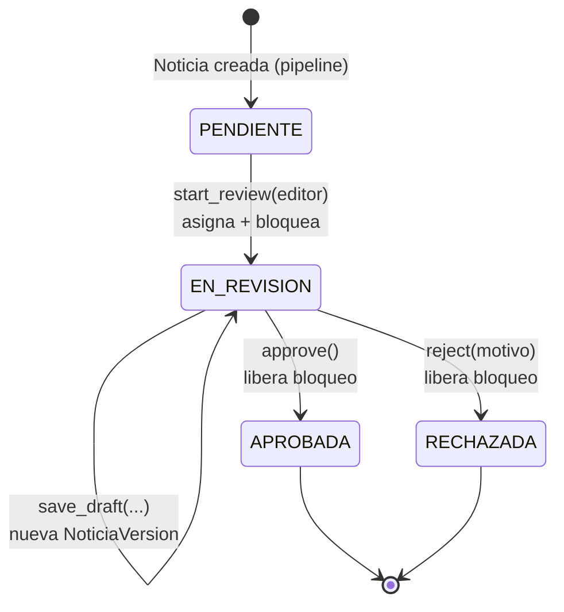

# EDITORIAL_DOMAIN.md

`NoticiaService` implementado — dominio y reglas de negocio del Centro Editorial (FR-050 a FR-058, RN-001 a RN-003), sin endpoints, sin auth/RBAC, sin publicación al cliente. Validado con tests de integración reales contra PostgreSQL (no mocks).

## Alcance de esta fase

| Pedido | Estado |
|---|---|
| Cola FIFO de revisión | ✅ `start_review()` |
| Asignación a un editor | ✅ (parte atómica de `start_review()`, ver nota abajo) |
| `start_review()` | ✅ |
| `save_draft()` creando `NewsVersion` | ✅ |
| `approve()` | ✅ |
| `reject()` | ✅ |
| `summary`/`transcription_text` completos en `NewsVersion` | ✅ (`resumen`/`transcripcion_texto` — nombres reales, ver nota de naming en `BACKEND_ARCHITECTURE.md`) |
| Historial completo de versiones | ✅ nunca se sobrescribe, verificado con test |
| Todo transaccional | ✅ un commit por operación pública, rollback+re-raise si falla a medio camino |

Explícitamente fuera de esta fase: endpoints FastAPI, autenticación, RBAC, frontend, publicación al cliente (`ClienteNoticia`).

## Por qué "cola FIFO" y "asignación" son una sola operación atómica

El pedido los lista como dos capacidades separadas, pero implementarlas por separado (ej. `siguiente_en_cola()` de solo lectura + `asignar(noticia_id, editor_id)` aparte) abriría una condición de carrera: entre que un periodista *ve* cuál es la siguiente noticia y el momento en que se le *asigna*, otro periodista podría tomar la misma. `start_review(editor_id)` hace ambas cosas en una sola transacción — el dequeue y la asignación son atómicos entre sí, que es exactamente lo que pide FR-051 (bloqueo exclusivo). El PRD tampoco describe una asignación manual (un supervisor asignando una noticia específica a un periodista específico) como caso de uso separado, así que no se construyó — si eso es necesario más adelante, es un método nuevo, no una modificación de este.

## Modelo — campos nuevos en `Noticia`

Migración `1c9fad29b98d`, aplicada contra Postgres real:

```python
asignado_a: uuid.UUID | None       # FK -> usuarios.id. NULL = no bloqueada
asignado_at: datetime | None
motivo_rechazo: str | None
```

## Máquina de estados implementada



`PUBLICADA` (del enum `EstadoNoticia` ya existente) no se usa todavía — corresponde a la fase de publicación al cliente, fuera de alcance aquí.

## `start_review(editor_id) -> Noticia`

Query FIFO con `SELECT ... FOR UPDATE SKIP LOCKED LIMIT 1` (`NoticiaRepository.siguiente_pendiente_con_lock`), ordenada por `created_at` ascendente — la noticia `PENDIENTE` más antigua. `SKIP LOCKED` es lo que hace el dequeue seguro con múltiples periodistas concurrentes: cada transacción se salta las filas que otra transacción tiene bloqueadas, en vez de esperar o de recibir la misma fila. **Validado con un test real de dos `Session` concurrentes** (`test_start_review_concurrente_no_entrega_la_misma_noticia`): la segunda sesión no ve la noticia que la primera ya tomó (sin commitear todavía) y correctamente levanta `ColaVacia`.

Si no hay ninguna `PENDIENTE`, levanta `ColaVacia` (no devuelve `None` — se eligió consistencia con el resto de las excepciones del dominio sobre un valor centinela).

## `save_draft(noticia_id, editor_id, **campos) -> NoticiaVersion`

Requiere que la noticia esté `EN_REVISION` y asignada a ese `editor_id` exacto (`NoticiaNoBloqueadaPorEditor` si no). Crea una `NoticiaVersion` nueva con `numero_version` incrementado — **nunca actualiza una fila existente**. Los campos no provistos (`titulo`, `resumen`, `transcripcion_texto`, `tema_id`, `subtema_id`) heredan el valor de la versión anterior, así que se puede editar un solo campo sin tener que reenviar todo el resto. `es_generada_por_ia=False`, `editado_por=editor_id` — a partir de la primera edición humana, la versión deja de ser atribuible solo a la IA.

Verificado con test: dos `save_draft()` consecutivos generan `numero_version` 2 y 3, cada edición hereda correctamente de la versión inmediatamente anterior (no de la v1 original), y las 3 versiones (1, 2, 3) siguen existiendo en la tabla — nada se borra ni se sobrescribe (RN-003/FR-071).

## `approve()` / `reject(motivo)`

Ambos requieren el mismo bloqueo que `save_draft()` (la IA nunca aprueba ni rechaza — RN-001/RN-002, solo el periodista que tiene la noticia asignada). Cambian `estado` y **liberan el bloqueo** (`asignado_a`/`asignado_at` vuelven a `NULL`) — la revisión de ese periodista ya terminó, sea cual sea el resultado. `reject()` además guarda `motivo_rechazo`.

Ninguno de los dos toca `ClienteNoticia` ni crea una nueva `NoticiaVersion` — aprobar/rechazar es un cambio de estado, no una edición de contenido.

## Transaccionalidad

Cada método público hace exactamente un `commit()` al final del camino feliz. Las excepciones de validación (`NoticiaNoEncontrada`, `NoticiaNoBloqueadaPorEditor`, `ColaVacia`) se lanzan **antes** de mutar nada, así que no hay nada que revertir en esos casos. En los caminos que sí mutan antes del commit final (`save_draft`, `approve`, `reject`), cualquier excepción inesperada dispara `rollback()` antes de relanzarla — no queda una `NoticiaVersion` a medio insertar ni un estado a medio cambiar.

## Tests (`tests/test_editorial_service.py`)

9 tests de integración contra PostgreSQL real (se saltan solos si no hay Postgres accesible). Cubren: orden FIFO correcto, cola vacía, concurrencia real con dos sesiones, creación/herencia/historial de versiones, y los cuatro casos de bloqueo violado (`save_draft`/`approve` sin tomar la noticia, o tomada por otro editor). Cada test limpia sus propias filas (noticias, versiones, usuarios de prueba) — la base queda en el mismo estado en el que empezó.

## Qué sigue

Ya se puede exponer esto por HTTP: `NoticiaService` no depende de FastAPI para nada, así que el próximo paso (cuando se retome) es wiring de `Depends`/sesión en `src/api/routers/editorial.py`, sin tocar el dominio. Después de eso, auth/RBAC para saber quién es `editor_id` en vez de recibirlo como parámetro directo, y finalmente la publicación al cliente (`ClienteNoticia`) cuando `approve()` lo requiera.
