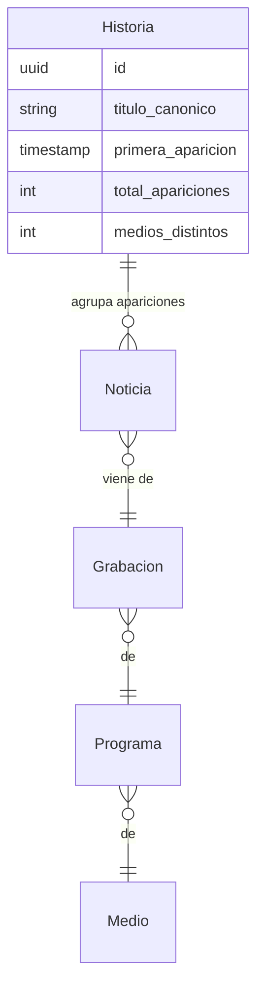

# EFFICIENCY_REVIEW.md

Revisión de eficiencia del sistema completo — **2026-07-22**.

Este documento nació como **propuesta priorizada**. Los puntos 1-5 de la tabla de §7 **ya están implementados** (2026-07-22); los puntos 6-8 siguen pendientes. Cada punto incluye el dato real que lo motiva, para que se pueda discutir con evidencia en vez de opinión.

> **Estado de implementación — leer antes de actuar.** El código está escrito, probado (22 tests nuevos) y desplegable, pero **todavía no se corrió sobre el backlog de producción**. Los umbrales de deduplicación y de detección de publicidad son valores de partida documentados, **no calibrados con datos de estas 15 emisoras**. Ver "Qué falta antes de correrlo en producción" al final de §7.

Los datos de la sección 1 se midieron directamente contra la base de datos de producción (`media-intel-mvp-backend`) el 2026-07-22. Todo lo que sea **cálculo derivado** o **estimación** está marcado como tal.

---

## 1. Datos medidos en producción (2026-07-22)

| Métrica | Valor | Cómo se obtuvo |
|---|---|---|
| Grabaciones totales | 14,371 | `SELECT count(*) FROM grabaciones` |
| Transcritas | 13,615 | `SELECT count(*) FROM transcripciones` |
| **Grabaciones que pasaron por el LLM/clipping** | **145** | `SELECT count(DISTINCT grabacion_id) FROM noticias` |
| `PipelineRun` completados | 225 | `SELECT count(*) FROM pipeline_runs WHERE estado='completado'` |
| Noticias generadas | 3,140 | `SELECT count(*) FROM noticias` |
| Palabras promedio por hora de audio | 3,834 | `avg(jsonb_array_length(segmentos->'words'))` |
| Duración promedio de una noticia | 84 s | `avg(clip_fin_seg - clip_inicio_seg)` |

**Lectura clave:** la transcripción va al 95% (13,615/14,371) pero la **segmentación por IA va al 1%** (145/14,371). Todo el costo de LLM del proyecto está por delante, no por detrás. Por eso las decisiones de costo/calidad del LLM conviene tomarlas **antes** de correr el backlog, no después.

### Cálculos derivados

- **Noticias por hora de transmisión:** 3,140 ÷ 145 = **21.7**
- **Minutos de noticia por hora:** 21.7 × 84 s = 1,823 s ≈ **30 min** → el **~50% del aire no es noticia** (publicidad, música, relleno)
- **Llamadas al LLM por grabación:** 3,834 palabras ÷ 600 (`chunk_size`) = **~7 llamadas**
- **Llamadas pendientes para el backlog:** 14,226 grabaciones × 7 ≈ **~91,000 llamadas a Claude**
- **Ritmo continuo:** 15 emisoras × 24 h = 360 grabaciones/día × 7 ≈ **~2,300 llamadas/día**

---

## 2. Hallazgo principal: la misma noticia se procesa 5-8 veces

Consulta sobre `noticia_versiones` agrupando por título:

| Título | Veces |
|---|---|
| Ampliación de jornada nacional de vacunación y desparasitación | 5 |
| Honduras primer lugar en embarazos adolescentes en América Latina | 5 |
| 298 alcaldes recibirán kit de maquinaria para mejorar carreteras | 5 |
| *Entrega de maquinaria a alcaldes para mejorar carreteras* | 3 |
| Día Internacional del Rock | 4 |
| *Día Mundial del Rock* | 3 |
| Previa de la semifinal Francia vs España en el Mundial | 3 |
| *Análisis previo del partido Francia vs España* | 3 |
| Rebaja en el precio de los combustibles | 3 |
| Aumento de casos de dengue en el Distrito Central | 3 |

Las filas en cursiva son **el mismo evento con otro título**, generado por el LLM en otra emisora:

- "298 alcaldes recibirán kit de maquinaria" (5) + "Entrega de maquinaria a alcaldes" (3) = **un solo evento, 8 apariciones**
- "Día Internacional del Rock" (4) + "Día Mundial del Rock" (3) = **7 apariciones**
- Las dos versiones del Francia vs España = **6 apariciones**

**Y esto sale de solo 145 grabaciones (1% del corpus).** Es el comportamiento esperable al monitorear 15 emisoras de un país chico: la noticia nacional se repite en todas.

### Por qué importa

1. **Un periodista revisa la misma historia 5-8 veces.** Es el costo operativo más grande del sistema y no es de infraestructura, es de tiempo humano.
2. **Deduplicar por título exacto NO alcanza** — los ejemplos en cursiva lo prueban. Se necesita agrupamiento semántico.
3. **Es una feature que el cliente quiere, no solo un ahorro.** "¿Qué emisoras cubrieron mi marca, cuántas veces, a qué hora?" es el reporte central de un producto de monitoreo, y hoy no se puede responder porque no existe el concepto de "historia" que agrupe apariciones.

### Modelo de dominio propuesto



Una `Historia` es el evento real; cada `Noticia` es una aparición de ese evento en una emisora/hora concreta. El periodista cura la `Historia` una vez; el sistema le muestra las N apariciones como evidencia de cobertura.

### Cómo implementarlo (enfoque estándar de la industria)

El patrón que usan los agregadores de noticias en producción:

1. Generar un **embedding** de `titulo + resumen` (los estudios de clustering de noticias coinciden en que título + entidades/ubicaciones tienen el mayor poder discriminante).
2. Comparar por **similitud coseno** contra las historias abiertas de una ventana temporal (ej. últimas 48-72 h — no contra todo el histórico).
3. Agrupar por **umbral** (la referencia común para "casi duplicado" ronda 0.95; para "misma historia, distinta redacción" el umbral es más bajo y hay que calibrarlo con datos reales de estas 15 emisoras).
4. Alternativa más barata sin embeddings: **MinHash + LSH** sobre shingles del texto — más rápido y sin costo de inferencia, pero peor con los casos de "distinta redacción" como el del Rock.

**Decisiones que hay que tomar antes de codificar:**
- ¿Ventana móvil de cuántas horas? (una historia puede reaparecer al día siguiente como seguimiento — ¿es la misma historia o una nueva?)
- ¿Umbral de similitud? Hay que calibrarlo etiquetando a mano ~100 pares de estas mismas emisoras.
- ¿Qué embedding? Uno multilingüe local (sin costo por llamada) vs API.
- ¿Se recalcula el `titulo_canonico` al agrupar, o se toma el de la primera aparición?

---

## 3. El ~50% del aire no es noticia y se paga completo

Medido: ~30 minutos de noticia por cada hora de transmisión. La otra mitad es publicidad, música y relleno — que hoy **se transcribe en GPU y se manda al LLM a precio completo** para descubrir que no había nada.

Ya está activo `vad_filter=True` en [faster_whisper_provider.py:31](../src/modules/transcription/providers/faster_whisper_provider.py:31), pero VAD detecta *voz*, no distingue voz-de-noticia de voz-de-comercial.

Dos ataques, de menor a mayor esfuerzo:

- **Huella acústica (fingerprint) de publicidad.** Los mismos anuncios se repiten idénticos decenas de veces al día. Se fingerprintea una vez, se guarda en una tabla de referencia, y se saltan para siempre. Es la técnica estándar en broadcast monitoring y ataca el caso de mayor volumen con lógica determinista (sin IA, sin costo por inferencia).
- **Clasificador música/voz** antes de transcribir, para las emisoras de radio con mucha programación musical.

**Ganancia estimada:** hasta ~50% menos GPU y ~50% menos llamadas al LLM. Es una estimación derivada del ratio medido, no un número validado — conviene medir sobre una muestra antes de comprometerse.

---

## 4. Costo del LLM

### Lo que ya está bien hecho (no tocar)

- **Prompt caching implementado correctamente** en [anthropic_provider.py:94](../src/modules/ai/providers/anthropic_provider.py:94) — `system` y `tools` marcados como cache breakpoint. Es la optimización correcta: esas partes son idénticas en cada llamada.
- **Segmentación en paralelo** con `ThreadPoolExecutor` (`max_concurrency=5`) — los chunks son independientes, no hay razón para serializarlos, y ya está resuelto.

### Lo que falta

**Batch API — 50% de descuento, riesgo cero.** Esta carga es 100% asíncrona: nada necesita respuesta en tiempo real. Procesar las ~91,000 llamadas pendientes por batch en vez de sincrónico es ahorro directo. El descuento de la Batch API es del 50% sobre todos los tokens, y **se acumula con el prompt caching que ya tienen**.

**Evaluar Haiku 4.5 para segmentación.** Hoy se usa `claude-sonnet-5` ([anthropic_provider.py:40](../src/modules/ai/providers/anthropic_provider.py:40)). Para extracción/clasificación de alto volumen, Haiku es el modelo recomendado por defecto y es sustancialmente más barato. **No cambiar a ciegas** — la propuesta concreta es: correr las mismas 50-100 grabaciones por Haiku y por Sonnet, comparar contra juicio humano (¿detecta las mismas noticias? ¿los límites start/end son iguales de precisos? ¿las entidades son correctas?) y decidir con datos. Posible resultado híbrido: Haiku por defecto, Sonnet solo en chunks donde Haiku reporte baja `confidence`.

---

## 5. Calidad de transcripción: `small` es la decisión más costosa

Hoy corre **Whisper Small**. Para monitoreo de medios esto importa más de lo que parece: **los nombres propios son el producto**. Si el sistema escribe mal "Xiomara Castro" o el nombre de una institución, la búsqueda por entidad del cliente simplemente falla.

`large-v3-turbo` cambió la ecuación desde que se tomó la decisión original:

| | Whisper Small (hoy) | large-v3-turbo (propuesto) |
|---|---|---|
| Parámetros | 244M | 809M |
| VRAM (INT8) | ~0.5 GB | **~1.6 GB** |
| Exactitud vs large-v3 | notablemente inferior | **>95% (brecha ~0.4 pp WER)** |
| Velocidad | rápido | 6-8x más rápido que large-v3 |

**La L4 tiene 23 GB y hoy se usan ~7 GB** (dato del `OPTIMIZATION_REPORT.md`) — hay espacio de sobra. Este es un salto de calidad grande a costo de VRAM despreciable.

**Complemento barato y de alto impacto:** pasar un **vocabulario de términos hondureños** (políticos, instituciones, partidos, municipios) como keyterm list. Las fuentes son explícitas en que los nombres propios en español —acentos + secuencias de letras poco frecuentes— son el punto débil de Whisper, y que una lista de términos personalizada reduce los errores significativamente. Este vocabulario ya existe implícitamente en el catálogo `Entidad`.

---

## 6. Otros puntos encontrados revisando el código

**Chunking sin solape** — [chunking.py:6](../src/modules/ai/chunking.py:6) lo documenta como limitación aceptada, pero con noticias de ~200 palabras promedio dentro de chunks de 600, una noticia partida en el límite pasa seguido. Un solape de ~15% + deduplicación de segmentos por rango de palabras lo resuelve con poco código.

**Entidades sin resolver** — "JOH" y "Juan Orlando Hernández" se guardan como strings crudos distintos en `NoticiaVersion.metadatos_ia`. El catálogo `Entidad` existe pero nada lo puebla (ya está anotado como fase posterior en `ORCHESTRATOR_DESIGN.md`). Sin esto no hay tracking real de menciones, que es el corazón de un producto de monitoreo — y también es lo que alimentaría el vocabulario del punto 5.

**Sentimiento sin implementar** — `ClienteNoticia.sentimiento` existe en el modelo pero nada lo puebla. Está correctamente marcado como paso posterior en el código; se menciona aquí solo para que quede en el mismo inventario.

### Infraestructura

**Spot para chepita** — 60-90% más barato, y esta carga es perfectamente tolerante a fallos: una interrupción solo devuelve el mensaje a SQS al expirar el `VisibilityTimeout` (1800 s), sin pérdida de trabajo, solo reprocesamiento. Caveat real: las interrupciones de **GPU** spot son 2-3x más frecuentes que las de CPU, porque AWS reclama capacidad GPU agresivamente. Aun así el peor caso aquí es retranscribir un archivo. Ya está diseñado (sin implementar) en la Fase 4 de [OPTIMIZATION_REPORT.md](OPTIMIZATION_REPORT.md).

**6 workers = 6 copias del modelo en la misma GPU** — la utilización queda en 66-68% y el propio `OPTIMIZATION_REPORT.md` concluye que el cuello no es cómputo sino "orquestación de 6 procesos compitiendo por la misma GPU". Con turbo en INT8 (1.6 GB) hay margen para replantear hacia un solo proceso con batching real en vez de 6 procesos independientes.

**`t3.small` corriendo backend + Postgres juntos** — el 2026-07-22 se cayó producción por un script de backfill que saturó esa instancia (ver el incidente en [INFRASTRUCTURE.md](INFRASTRUCTURE.md)). Postgres debería salir de ahí (RDS o instancia dedicada) antes de subir el volumen.

**Los workers no arrancan solos** — no hay unidad systemd; al lanzar instancias nuevas hay que arrancar los 6 workers a mano vía SSM. Y el AMI se desincroniza del repo: el bug de `DONE_QUEUE_URL` del 2026-07-22 (5 de 6 instancias transcribiendo sin reportar a Postgres) fue exactamente eso.

---

## 7. Priorización propuesta

| # | Acción | Impacto | Estado |
|---|---|---|---|
| 1 | **Batch API** antes de correr el backlog de ~91k llamadas | 50% del costo LLM | ✅ implementado |
| 2 | **Deduplicación semántica** entre emisoras (entidad `Historia`) | 5-8x menos trabajo editorial + feature vendible | ✅ implementado |
| 3 | `small` → **`large-v3-turbo`** + vocabulario hondureño | Calidad de nombres propios = calidad del producto | ✅ código listo, falta hornear AMI |
| 4 | **Saltar publicidad repetida** | ~50% menos llamadas al LLM | ✅ implementado (por texto, no audio) |
| 5 | **Resolución de entidades** al catálogo `Entidad` | Habilita tracking real de menciones | ✅ implementado |
| 6 | **Spot** para chepita | 60-90% del costo GPU | ⬜ pendiente |
| 7 | **Solape en chunking** | Deja de partir noticias a la mitad | ⬜ pendiente |
| 8 | Sacar **Postgres del `t3.small`** | Estabilidad (ya falló una vez) | ⬜ pendiente |

### Qué se construyó (puntos 1-5)

| Pieza | Archivo |
|---|---|
| Batch API (armado, envío, recolección) | [`src/modules/ai/batch.py`](../src/modules/ai/batch.py) |
| Provider que consume segmentos ya calculados | [`src/modules/ai/providers/precomputed_provider.py`](../src/modules/ai/providers/precomputed_provider.py) |
| Detección de publicidad repetida | [`src/modules/ai/repeated_content.py`](../src/modules/ai/repeated_content.py) |
| Resolución de entidades | [`src/modules/ai/entity_resolution.py`](../src/modules/ai/entity_resolution.py) |
| Embeddings (puerto + adaptador OpenAI) | [`src/modules/ai/embeddings.py`](../src/modules/ai/embeddings.py) |
| Agrupamiento en `Historia` | [`src/modules/editorial/dedup.py`](../src/modules/editorial/dedup.py) |
| Vocabulario hondureño para Whisper | [`src/modules/transcription/vocabulary.py`](../src/modules/transcription/vocabulary.py) |
| Migración (4 tablas + columnas) | `alembic/versions/b8e4f21a7c30_*.py` |
| Tests (22) | [`tests/test_efficiency_features.py`](../tests/test_efficiency_features.py) |

Scripts operativos, en el orden en que conviene correrlos:

```bash
python scripts/learn_repeated_content.py --limit 2000   # 1. indexa qué se repite
python scripts/segment_backlog_batch.py --submit --limit 200
python scripts/segment_backlog_batch.py --status        # 2. esperar (hasta 24h)
python scripts/segment_backlog_batch.py --collect
python scripts/resolve_entities.py                      # 3. tras generar Noticias
python scripts/cluster_historias.py --dry-run           # 4. calibrar antes de escribir
```

### Qué falta antes de correrlo en producción

1. **Calibrar el umbral de deduplicación.** El default (0.83) es un punto de partida, no un valor medido con estas emisoras. `HistoriaClusterer.calibrar()` recibe pares etiquetados a mano y reporta falsos positivos/negativos por umbral. Correr `cluster_historias.py --dry-run` primero. El error caro es el falso positivo: fusionar dos noticias distintas es silencioso.
2. **Validar el umbral de publicidad** (5 apariciones). Revisar a mano una muestra de `contenido_repetido` con `veces_visto >= 5` antes de confiar en el filtro. La columna `es_publicidad` existe para corregir a mano sin tocar código.
3. **Hornear AMI `v1.2.0`** con los pesos de `large-v3-turbo` precargados. Sin eso funciona igual, pero cada instancia nueva baja ~1.6 GB de HuggingFace en el primer arranque.
4. **Medir turbo vs small con el rigor del `OPTIMIZATION_REPORT.md`** (una variable, mismo set de archivos) antes de darlo por bueno. La ganancia de calidad es esperable por los benchmarks públicos, no medida sobre audio hondureño.
5. **Evaluar Haiku vs Sonnet** para segmentación (§4) — no se cambió el modelo, sigue `claude-sonnet-5`.

**1, 3, 6 y 7 son cambios chicos y bastante independientes** — se pueden hacer de inmediato.

**2 es el que más cambia el producto** y amerita diseñarlo antes de codificar: entidad de dominio nueva, elección de modelo de embeddings, calibración del umbral con datos reales, y definir la ventana temporal de agrupamiento.

**Regla que conviene mantener:** el `OPTIMIZATION_REPORT.md` estableció una buena disciplina — una variable por prueba, misma infra, mismo set de archivos, y se descarta lo que no mejore de forma medible. Vale la pena aplicar el mismo rigor a estas propuestas (sobre todo a la 3 y la 4) en vez de asumir la ganancia.

---

## 8. Fuentes consultadas

Transcripción:
- [Best open source speech-to-text (STT) model in 2026 — Northflank](https://northflank.com/blog/best-open-source-speech-to-text-stt-model-in-2026-benchmarks)
- [openai/whisper-large-v3-turbo — HuggingFace](https://huggingface.co/openai/whisper-large-v3-turbo)
- [Deploy Whisper v3 Large Turbo in Production — Simplismart](https://simplismart.ai/blog/deploy-whisper-v3-turbo-using-vox-box)
- [Spanish Transcription: Dialects, Engines, Accuracy 2026](https://convertaudiototext.com/blog/spanish-transcription-guide)
- [How Accurate Is Whisper in 2026? (WER Data by Language)](https://novascribe.ai/how-accurate-is-whisper)

Costo de LLM:
- [Claude Cost Optimization 2026: Batch API (50% Off) and Prompt Caching (90% Off)](https://pecollective.com/tools/claude-pricing-guide/)
- [Anthropic API Pricing in 2026: Complete Guide — Finout](https://www.finout.io/blog/anthropic-api-pricing)

Deduplicación y clustering de noticias:
- [Optimizing News Aggregation: Clustering & Deduplication — Feedly](https://feedly.com/engineering/posts/reducing-clustering-latency)
- [Articles deduplication — NewsCatcher](https://www.newscatcherapi.com/docs/news-api/guides-and-concepts/articles-deduplication)
- [Deduplicating Millions of Conversations Every Day — pressrelations](https://www.pressrelations.com/blog/en/deduplicating-millions-of-conversations-every-day)
- [Improved Near-Duplicate Detection for Aggregated Content — NAACL 2025](https://aclanthology.org/2025.naacl-industry.73.pdf)
- [Near Real-time News Clustering and Summarization for FSI — AWS](https://aws.amazon.com/blogs/industries/near-real-time-news-clustering-and-summarization-for-fsi/)

Monitoreo de broadcast:
- [Automated Ad Detection for Broadcasters and Brands — Digital Nirvana](https://digital-nirvana.com/blog/real-time-compliance-monitoring-broadcast/)
- [Commercial detection based on audio fingerprinting — US Patent 9503781](https://image-ppubs.uspto.gov/dirsearch-public/print/downloadPdf/9503781)

Infraestructura:
- [Spot Instance GPU Strategy — ComputingPower.org](https://computingpower.org/providers/spot-instance-guide)
- [EC2 GPU Instances: A Full Guide to AWS GPUs (July 2026) — Thunder Compute](https://www.thundercompute.com/blog/ec2-gpu-instances)
