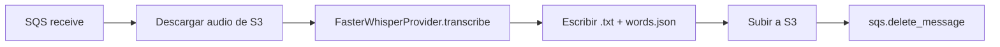
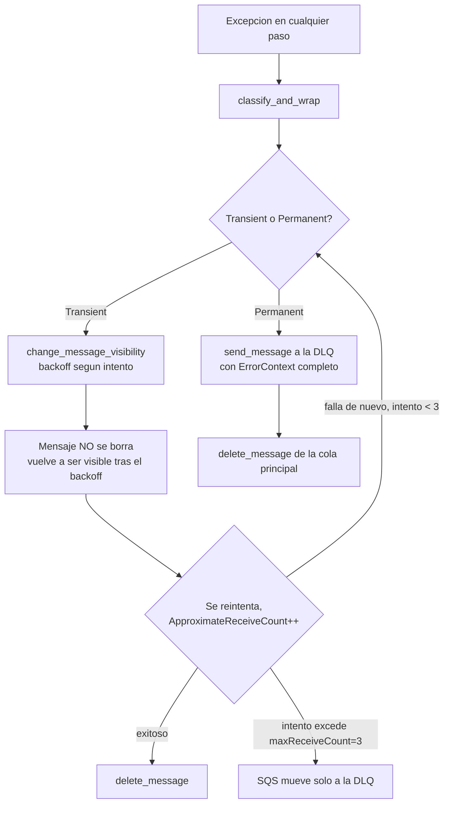

# ERROR_HANDLING.md

Manejo de errores del pipeline de transcripción, con Amazon SQS DLQ como respaldo final. Objetivo: ningún archivo se pierde, y ningún mensaje queda reintentándose indefinidamente.

## Infraestructura SQS (ya existía, verificada — no creada en esta sesión)

```
Cola principal: media-intel-transcription-jobs
  VisibilityTimeout: 1800s
  RedrivePolicy: { deadLetterTargetArn: media-intel-transcription-jobs-dlq, maxReceiveCount: 3 }

Dead Letter Queue: media-intel-transcription-jobs-dlq
  MessageRetentionPeriod: 1209600s (14 días)
```

Al inspeccionar la cola real (`aws sqs get-queue-attributes`) resultó que el `RedrivePolicy` **ya estaba configurado** con `maxReceiveCount=3` apuntando a una DLQ que ya existía. No se creó infraestructura nueva — solo se agregó el permiso IAM que faltaba (`sqs:ChangeMessageVisibility`, necesario para el backoff) al rol `media-intel-ec2-transcribe`, y se construyó el manejo de errores del lado del worker que hoy no existía.

`maxReceiveCount=3` es el límite duro final: pase lo que pase en el código del worker, SQS nunca entrega un mensaje más de 3 veces — al 4to intento lo mueve solo a la DLQ, sin que nuestro código tenga que hacer nada. Esto es importante: **aunque el clasificador de errores se equivoque** (como pasó una vez durante las pruebas de esta sesión, ver más abajo), el sistema igual tiene un techo duro de reintentos.

## Tipos de error

`src/shared/errors.py`:

```python
class PipelineError(Exception): ...          # base, nunca se lanza directo
class TransientPipelineError(PipelineError): ...  # reintentable
class PermanentPipelineError(PipelineError): ...  # NO reintentable
```

`classify_and_wrap(exc, module=...)` traduce excepciones reales a una de las dos categorías:

| Origen | Transitorio (reintentar) | Permanente (a la DLQ ya) |
|---|---|---|
| S3 / botocore | `SlowDown`, `InternalError`, `ServiceUnavailable`, `Throttling`, errores de conexión | `NoSuchKey`, `NoSuchBucket`, `AccessDenied`, **`404`/`403`** (ver nota abajo), `InvalidArgument` |
| OpenAI | `RateLimitError`, `APITimeoutError`, `APIConnectionError`, `InternalServerError` | `BadRequestError`, `AuthenticationError`, `PermissionDeniedError`, `NotFoundError` |
| FFmpeg (subprocess) | stderr contiene "no space left on device" | cualquier otro fallo (archivo dañado, formato inválido) |
| Datos | — | `json.JSONDecodeError`, `pydantic.ValidationError` (words.json/JSON mal formado) |
| Red genérica | `TimeoutError`, `ConnectionError` | — |
| Código de error botocore desconocido | **transitorio por default** (respaldo: `maxReceiveCount`) | — |

**Nota real encontrada en pruebas contra AWS:** `boto3` `download_file()` hace un `HeadObject` antes del `GetObject`. Una key inexistente responde con `code="404"`, no `"NoSuchKey"` (eso solo pasa con `GetObject` directo). La primera versión del clasificador no conocía `"404"` y lo trató como transitorio por default — se gastaron 2 reintentos de más antes de detectarlo y corregirlo. Ya está corregido y cubierto por un test de regresión (`tests/test_errors.py::test_botocore_404_from_download_file_head_object_is_permanent`). Se documenta aquí a propósito: es el ejemplo real de por qué el `maxReceiveCount` de SQS es el respaldo que importa, no la clasificación de nuestro código — un error de clasificación se limita a desperdiciar reintentos, nunca deja un mensaje atrapado para siempre.

## Contexto de error registrado

`src/shared/error_context.py` — `ErrorContext`, con exactamente los campos pedidos:

```python
class ErrorContext(BaseModel):
    job_id: str          # MessageId de SQS -- no requiere cambiar el formato del job
    module: str           # "download" | "transcribe_or_upload" | ...
    audio_ref: str | None # s3_input del job
    error_type: str        # nombre de la clase de excepcion
    error_message: str
    stack_trace: str       # traceback completo
    attempt: int            # ApproximateReceiveCount de SQS
    occurred_at: str        # ISO 8601 UTC
```

Se emite como un log JSON estructurado por `src/shared/logging_utils.py` (usa el `logging` estándar de Python + un `Formatter` a JSON, sin dependencias nuevas — cierra la deuda técnica R7 de `ARCHITECTURE_REVIEW.md` para el camino de errores). Ejemplo real capturado en esta sesión:

```json
{"timestamp": "2026-07-19T22:16:46+0000", "level": "ERROR", "logger": "src.modules.transcription.queue.dlq_handler",
 "message": "pipeline error en modulo=download job_id=d6f6196b-... attempt=3",
 "job_id": "d6f6196b-4489-42be-b7eb-3afd2c216cee", "module": "download",
 "audio_ref": "s3://mediadev-recordings/does/not/exist.mp3",
 "error_type": "PermanentPipelineError",
 "error_message": "[download] An error occurred (404) when calling the HeadObject operation: Not Found",
 "stack_trace": "src.shared.errors.PermanentPipelineError: ...\n",
 "attempt": 3, "occurred_at": "2026-07-19T22:16:46.930776+00:00"}
```

## Flujo normal



Sin cambios respecto a antes de esta sesión — mismo happy path, mismo rendimiento (validado con smoke test idéntico antes/después).

## Flujo de error



**Backoff** (`src/modules/transcription/queue/retry_policy.py`) — creciente por intento, no el `VisibilityTimeout` fijo de 1800s:

| Intento (`ApproximateReceiveCount`) | Espera antes del siguiente intento |
|---|---|
| 1 | 30s |
| 2 | 90s |
| 3 | 240s |
| (el intento 4 nunca llega al worker — SQS lo redirige a la DLQ antes de entregarlo) |

## Flujo hacia la DLQ

Dos caminos, a propósito distintos:

1. **Permanente → inmediato.** El worker mismo llama `sqs.send_message` a la DLQ con el `ErrorContext` completo adjunto, y borra el mensaje de la cola principal. No se desperdician los 3 intentos en algo que ya se sabe que nunca va a funcionar (audio corrupto, key inexistente, JSON inválido).
2. **Transitorio repetido → automático.** El worker no hace nada especial — deja que `RedrivePolicy` de SQS mueva el mensaje a la DLQ solo, después de 3 entregas fallidas. Esto es 100% nativo de SQS, no hay código nuestro en ese camino (aparte de no borrar el mensaje).

En ambos casos, el mensaje que llega a la DLQ tiene este formato:

```json
{
  "original_job": { "grabacion_id": "uuid", "station": "...", "s3_input": "s3://...", "s3_output_prefix": "s3://..." },
  "error": { "job_id": "...", "module": "...", "audio_ref": "...", "error_type": "...",
             "error_message": "...", "stack_trace": "...", "attempt": 3, "occurred_at": "..." }
}
```

`grabacion_id` (ver [INGESTION_DESIGN.md](INGESTION_DESIGN.md)) es lo que le permite a `TranscriptionFailureConsumer` marcar la `Grabacion` correspondiente como `error` en Postgres sin tener que adivinar a qué fila corresponde el fallo.

Para el camino 2 (redrive automático), la DLQ solo tiene el `Body` original de SQS — sin el envelope `error` — porque SQS lo mueve él mismo, sin pasar por nuestro código. Si se quiere el mismo nivel de detalle en ambos casos, la opción es bajar `maxReceiveCount` a 1 y dejar que **todo** pase por el camino de clasificación propia — evaluado y descartado por ahora: perdería la distinción transitorio/permanente y volvería a gastar 0 reintentos en errores genuinamente transitorios.

## Validado contra AWS real

- **Camino feliz:** smoke test idéntico al de antes del refactor (2761 palabras, mismos valores, 0 fallos) — el manejo de errores no tocó el rendimiento validado.
- **Camino permanente:** se encoló un job con una key de S3 inexistente. Primer intento se clasificó mal (ver nota del código `"404"` arriba) como transitorio; corregido; al tercer intento se clasificó correctamente como permanente, se reenvió a la DLQ con el envelope completo (verificado leyendo el mensaje real de la DLQ), y la cola principal quedó en 0 mensajes.
- **Camino transitorio (backoff):** validado con test unitario (`tests/test_dlq_handler.py::test_transient_error_extends_visibility_and_does_not_delete`) contra un cliente SQS simulado — no se forzó un rate limit real de OpenAI ni una caída real de S3 para esta prueba, sería intrusivo/costoso de simular contra servicios reales.

## Recuperación manual / reprocesar desde la DLQ

Procedimiento para cuando un humano revisa la DLQ y decide reintentar (ej. después de arreglar el archivo de audio, o confirmar que un rate limit ya pasó):

1. **Leer los mensajes de la DLQ sin borrarlos**, para decidir cuáles reprocesar:
   ```bash
   aws sqs receive-message \
     --queue-url https://sqs.us-east-1.amazonaws.com/050871635829/media-intel-transcription-jobs-dlq \
     --max-number-of-messages 10 \
     --visibility-timeout 0
   ```
   Cada `Body` tiene `original_job` (el job tal cual se puede re-encolar) y `error` (por qué falló, cuándo, en qué módulo — para decidir si vale la pena reintentar).

2. **Re-encolar el job original a la cola principal:**
   ```python
   import json, boto3
   sqs = boto3.client("sqs")
   dlq_msg = json.loads(dlq_body)  # el Body leído en el paso 1
   sqs.send_message(
       QueueUrl="https://sqs.us-east-1.amazonaws.com/050871635829/media-intel-transcription-jobs",
       MessageBody=json.dumps(dlq_msg["original_job"]),
   )
   ```

3. **Borrar el mensaje de la DLQ** una vez confirmado el re-encolado (con el `ReceiptHandle` obtenido en el paso 1):
   ```bash
   aws sqs delete-message --queue-url .../media-intel-transcription-jobs-dlq --receipt-handle "..."
   ```

4. Si el job vuelve a fallar por la misma razón permanente, va a volver a la DLQ de inmediato (mismo camino 1) — no hay riesgo de reintroducir un loop infinito, porque la clasificación permanente es determinista sobre el mismo tipo de error.

No hay automatización de este proceso todavía (a propósito — fuera de alcance de esta fase, que era solo manejo de errores del pipeline, no una consola de operaciones). Es un procedimiento manual, documentado aquí para que cualquiera en el equipo lo pueda ejecutar sin tener que leer el código primero.
