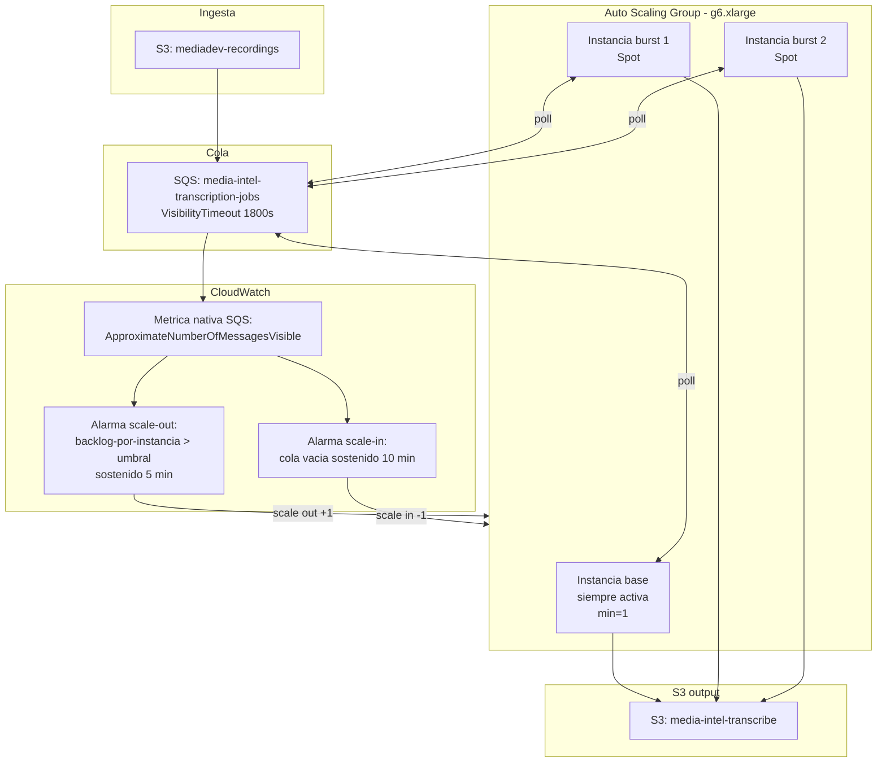

# OPTIMIZATION_REPORT.md

Fase de optimización sobre la configuración base de producción validada en benchmarking (20/20 archivos, 0 errores).

**Infraestructura usada en todas las pruebas (sin cambios):**
- Instancia: `i-04ca44c8228a1611a` (g6.xlarge, "media-intel-chepita-g6-test")
- GPU: NVIDIA L4, 23034 MiB VRAM totales
- Modelo: Whisper Small vía Faster-Whisper (`BatchedInferencePipeline`)
- compute_type: `int8_float16`
- Workers persistentes: 6 (`w0`..`w5`), un modelo cargado por worker, consumiendo la misma cola SQS
- Cola: `media-intel-transcription-jobs` (VisibilityTimeout 1800s)
- Set de archivos: los mismos 20 mensajes de `enqueue_20h.py` (10 estaciones x 2 horarios) en **todas** las corridas
- Acceso/ejecución: AWS Systems Manager Run Command (sin SSH) contra la instancia real, con `nvidia-smi --query-gpu=... -l 1` y muestreo de CPU/RAM (`mpstat`/`free`) corriendo en paralelo durante toda la ejecución

**Regla aplicada:** una sola variable por prueba, misma infraestructura, mismo set de archivos, métricas registradas en cada corrida, y cualquier cambio que empeore rendimiento/estabilidad se descarta.

**Aclaración metodológica importante:** las 4 corridas se ejecutaron consecutivamente (b24 → b32 → b16 → pf24) sobre la misma GPU, sin tiempo de enfriamiento entre ellas. Esto significa que la **temperatura** de cada corrida está parcialmente influenciada por el calor residual de la corrida anterior (carryover térmico), no solo por la carga de esa configuración — se reporta igualmente porque ninguna corrida se acercó a throttling (todas < 80°C, muy por debajo del límite térmico de la L4), pero no debe leerse como una comparación aislada de "calor generado por cada config".

---

## 1. Todas las pruebas realizadas

| # | Prueba | batch_size | Prefetch | Total (s) | Archivos/min | Errores |
|---|--------|-----------|----------|-----------|--------------|---------|
| 1 | Baseline (referencia) | 16 | No | 226 | 5.31 | 0/20 |
| 2 | Fase 1 | 24 | No | 215 | 5.58 | 0/20 |
| 3 | Fase 1 | 32 | No | 221 | 5.43 | 0/20 |
| 4 | Fase 2 | 24 (óptimo de Fase 1) | Sí | 207 | 5.80 | 0/20 |

Todas las corridas: 20/20 archivos procesados, 0 errores, 0 mensajes duplicados o perdidos en SQS.

## 2. Tablas comparativas

### Fase 1 — Batch tuning

| Batch | Tiempo total | Tiempo prom./archivo | Archivos/min | GPU % avg/max | VRAM avg/max (MiB, % de 23034) | Power avg/max (W) | Temp avg/max (°C) | CPU % avg | RAM libre mín (MB) | Errores |
|-------|-------------|----------------------|---------------|----------------|-------------------------------|--------------------|--------------------|-----------|--------------------|---------|
| 16 (baseline) | 226 s | 50.5 s | 5.31 | 66.4 / 100.0 | 5864 / 11338 (25% / 49%) | 58.9 / 73.3 | 69.5 / 79.0 | 80.8 | 836 | 0 |
| **24** | **215 s** | **47.4 s** | **5.58** | 67.8 / 100.0 | 6971 / 15050 (30% / 65%) | 58.6 / 74.6 | 62.4 / 70.0 | 80.5 | 1741 | 0 |
| 32 | 221 s | 52.4 s | 5.43 | 66.1 / 100.0 | 9369 / 19178 (41% / 83%) | 58.2 / 74.5 | 67.9 / 78.0 | 84.3 | 534 | 0 |

**Recomendación de batch: `batch_size = 24`.**

- Es el más rápido en tiempo total (215 s) y mejor throughput (5.58 archivos/min), superando al baseline en **-4.9% tiempo total / +5.1% throughput**.
- `batch_size = 32` **no mejora** sobre 24 (221 s vs 215 s, throughput menor) y consume sustancialmente más VRAM en el pico (83% de la GPU vs 65% con batch 24) y más RAM de host libre mínima consumida (534 MB libres vs 1741 MB) — más riesgo, cero beneficio medido. Por la regla de descarte automático, **batch 32 se descarta**.
- La utilización de GPU (66-68%) y el consumo de potencia (~58-60W de una L4 que soporta hasta 72W TDP típico) indican que el cuello de botella no es cómputo puro de la GPU sino el pipeline completo (I/O + VAD + orquestación de 6 procesos independientes compitiendo por la misma GPU) — consistente con que subir el batch más allá de 24 no rinde beneficio adicional.

### Fase 2 — Prefetch (sobre batch_size=24)

| Métrica | Sin prefetch (batch 24) | Con prefetch (batch 24) | Diferencia |
|---------|--------------------------|---------------------------|------------|
| Tiempo total | 215 s | 207 s | **-8 s (-3.7%)** |
| Archivos/min | 5.58 | 5.80 | **+3.9%** |
| GPU % avg/max | 67.8 / 100.0 | 70.7 / 100.0 | +2.9 pp avg |
| VRAM avg/max (MiB) | 6971 / 15050 | 7283 / 14858 | ~sin cambio |
| CPU % avg | 80.5 | 88.6 | +8.1 pp (hilo extra de descarga) |
| RAM libre mín (MB) | 1741 | 242 | **-1499 MB** |
| Tiempo esperando descarga (agregado, 6 workers, 20 archivos) | no medido directamente (descarga inline antes de transcribir) | **~3.7 s total** (0.2–1.5 s por archivo, la mayoría prácticamente 0) | — |
| Errores | 0/20 | 0/20 | — |

**¿Mejora estadísticamente significativa?** Es una mejora real y consistente (-3.7% tiempo total, +2.9 pp de utilización de GPU, 0 archivos esperando descarga de forma bloqueante), pero de magnitud **modesta**: los archivos de audio (~1h de radio comprimido) descargan en 0.2–1.5 s desde S3 dentro de la misma región, una fracción pequeña frente a los 20-90 s que toma transcribir cada archivo. El techo de mejora del prefetch está limitado por lo rápida que ya era la descarga — no había mucho tiempo muerto que eliminar. Aun así, se recomienda mantenerlo porque no tiene contrapartida negativa en throughput ni estabilidad (0 errores, sin descargas duplicadas, limpieza automática de temporales confirmada).

**Alerta a monitorear:** la RAM libre mínima cayó a 242 MB (de 15 GB totales) con prefetch activo. No causó fallos en esta prueba, pero es el punto más bajo observado en las 4 corridas y merece una alarma de CloudWatch en producción antes de escalar la carga.

## 3. Implementación de prefetch (Fase 2)

`worker_prefetch.py` (desplegado en la instancia junto a `worker.py` original, sin reemplazarlo):

- Un solo hilo adicional (`threading.Thread(daemon=True)`) que hace `receive_message` + `download_file` de forma continua.
- Comunicación con el hilo principal vía `queue.Queue(maxsize=1)`: esto garantiza que nunca se descargue más de un archivo por delante (no hay "N+2" descargándose mientras N+1 espera) — cumple "no consumir memoria innecesaria".
- Cada mensaje SQS se recibe **una sola vez**, siempre desde el hilo de prefetch — el hilo principal nunca llama `receive_message`, así que no hay descargas duplicadas.
- Limpieza automática: `os.remove()` del audio y del `.txt` local inmediatamente después de subir el resultado a S3.
- `VisibilityTimeout` de la cola (1800 s) es suficiente margen para que el archivo prefetched no expire su reserva mientras el worker termina el archivo anterior.

## 4. Configuración recomendada para producción

```
Instancia:      g6.xlarge
GPU:            NVIDIA L4
Modelo:         Whisper Small
Backend:        Faster-Whisper (BatchedInferencePipeline)
compute_type:   int8_float16
batch_size:     24          <- cambio (antes 16)
Workers:        6 (persistentes + SQS, sin cambios)
Prefetch:       activado (worker_prefetch.py)  <- nuevo
```

Ganancia combinada medida vs. el baseline actual (batch 16, sin prefetch): **226 s → 207 s (-8.4% tiempo total, +9.2% throughput: 5.31 → 5.80 archivos/min)**, con 0 errores en ambas puntas.

## 5. Configuración descartada

- **`batch_size = 32`**: más lento que 24 (221 s vs 215 s) y con mucho menos margen de VRAM (83% de pico vs 65%) y RAM de host (534 MB libres mínimos vs 1741 MB). Sin beneficio medido, mayor riesgo → descartado por la regla de auto-descarte.

## 6. Próximas optimizaciones posibles

### Fase 3 — Batch dinámico (propuesta, no implementada)

**Objetivo:** ajustar `batch_size` automáticamente por archivo según VRAM libre, duración del audio y utilización de GPU reciente, en vez de un valor fijo.

**Enfoque propuesto:**
1. Antes de transcribir, consultar VRAM libre real vía `pynvml`/`nvidia-smi` (no solo lo reservado por el propio proceso, sino lo disponible considerando los otros 5 workers en la misma GPU).
2. Usar una tabla de umbrales simple en vez de un modelo complejo, p. ej.: VRAM libre > 12 GB y duración estimada > 5 min → batch 32; VRAM libre 6–12 GB → batch 24; VRAM libre < 6 GB → batch 16 — con un mecanismo de back-off si la utilización de GPU está saturada (>95% sostenido) durante varios segundos.
3. La duración del audio solo se conoce con certeza después de que `faster_whisper` decodifica el header, así que requiere un paso ligero de inspección previa (o metadata ya conocida del pipeline de ingesta) antes de decidir el batch.

**Ventajas:** se adapta a la mezcla real de duraciones sin tuning manual; podría capturar algo del margen de VRAM que batch=24 deja sin usar en archivos cortos.

**Riesgos:**
- **Condición de carrera de VRAM compartida**: los 6 workers son procesos independientes en la misma GPU. Si dos workers miden "VRAM libre" al mismo tiempo y ambos deciden subir a batch alto simultáneamente, pueden sobre-comprometer la VRAM real y producir OOM — esto requeriría coordinación entre procesos (semáforo compartido, o un servicio central que arbitre), lo cual añade complejidad no trivial.
- Introduce no-determinismo en tiempos de transcripción, lo que complica SLAs.
- Riesgo de oscilación (thrashing) entre tamaños de batch si el heurístico reacciona a ruido de medición en vez de una señal estable.

**Complejidad estimada:** Media-Alta. Requiere telemetría en vivo por proceso, estimación de duración pre-transcripción, y coordinación entre los 6 workers para evitar sobre-commit de VRAM.

**Nota de ROI:** dado que en Fase 1 la ganancia de subir batch de 16→24 fue de ~5% y subir a 32 no rindió nada, el techo de mejora disponible por ajuste de batch dentro de este rango parece limitado. Se recomienda evaluar el ROI de la complejidad de coordinación entre procesos antes de invertir en implementarlo.

### Fase 4 — Escalamiento horizontal (propuesta, no implementada)

**Diagrama de arquitectura:**



**Flujo completo:**
1. La profundidad de la cola SQS ya se publica de forma nativa a CloudWatch (`ApproximateNumberOfMessagesVisible`) — no requiere instrumentación adicional.
2. Una política de **Target Tracking Scaling** del ASG usa el ratio "backlog por instancia" (mensajes visibles / capacidad deseada actual) como métrica de referencia. Cuando el backlog supera el umbral configurable (ej. 200 archivos) sostenido, el ASG lanza +1 instancia g6.xlarge.
3. La nueva instancia arranca desde un Launch Template con AMI pre-cargada con drivers CUDA + faster-whisper (evita reinstalar dependencias en cada boot) y `worker_prefetch.py` corriendo como servicio systemd que apunta a la misma `QUEUE_URL` — se une a consumir la cola sin coordinación adicional (SQS reparte mensajes automáticamente).
4. Para el scale-in: una alarma de CloudWatch dispara cuando la cola permanece vacía un tiempo configurable (ej. 10 min). El propio `worker.py`/`worker_prefetch.py` ya sale solo tras 3 rondas idle sin mensajes — esto sirve como mecanismo de "drenado" natural: al bajar el ASG desired capacity, no se mata un worker a mitad de una transcripción porque el worker mismo decide terminar cuando no hay trabajo. Se recomienda además un **lifecycle hook** de terminación para dar margen a que el worker en curso termine su archivo actual antes de que EC2 lo apague.
5. La instancia base (`min=1`) nunca se termina por esta lógica — solo se agregan/quitan instancias de burst por encima del piso.

**Componentes AWS:**
- SQS (ya existe, sin cambios) + métrica nativa de CloudWatch
- Auto Scaling Group de EC2 (g6.xlarge) con Launch Template
- CloudWatch Alarms (scale-out por backlog, scale-in por cola vacía sostenida)
- IAM role existente (`media-intel-ec2-transcribe`) reutilizado en el Launch Template
- Systems Manager (ya en uso) para gestión operativa sin SSH
- Opcional: SNS para notificar eventos de scale-out/in al equipo

**Estimación de costos (aproximada, on-demand us-east-1, sujeta a cambios de AWS):**
- g6.xlarge on-demand ≈ **$0.80–1.00/hora**. La instancia base (min=1) ya está corriendo hoy — sin costo incremental.
- Capacidad de burst (hasta 2 instancias adicionales) usando **Spot** en vez de on-demand: descuento típico de 60-70% sobre on-demand (≈ $0.25–0.40/hora por instancia). Es seguro para esta carga porque una interrupción de Spot simplemente devuelve el mensaje a SQS tras expirar el VisibilityTimeout (1800s) — no hay pérdida de trabajo, solo reprocesamiento.
- Ejemplo: 2 instancias burst activas en promedio 4h/día → ~$2.00–3.20/día → **~$60–100/mes** adicionales, escalando a $0 cuando la cola está vacía (diseño scale-to-zero por encima del piso).

**Riesgos:**
- Cold start: carga del modelo (~7-10s) + boot de instancia (~1-2 min) hace que la capacidad de burst tarde unos minutos en responder a un pico repentino de cola — no es escalado instantáneo.
- Las Fases 1 y 2 mostraron que la RAM de host libre mínima ya llega a niveles bajos (242 MB con prefetch) con 6 workers en una sola instancia. Escalar horizontalmente reparte carga entre instancias pero **no resuelve** una eventual presión de memoria por-instancia; conviene revalidar si 6 workers por instancia sigue siendo el número correcto antes de asumir escalado lineal.
- Riesgo de costo descontrolado si la alarma de scale-in falla silenciosamente — se recomienda un budget alarm adicional como red de seguridad.
- Spot para burst requiere que el VisibilityTimeout siga siendo suficientemente largo para sobrevivir una interrupción + re-encolado (ya lo es: 1800s).

**Recomendaciones:**
- Empezar con `max=2` instancias de burst (3 total) usando Spot, política target-tracking sobre backlog-por-instancia, y alarma compuesta de cola-vacía-10-min para el scale-in.
- Validar el supuesto de 6 workers/instancia y el headroom de RAM de host antes de subir el `max` del ASG.
- No implementar hasta tener un budget alarm y confirmar la revalidación de RAM mencionada arriba.

## 7. Recomendación final para producción

Adoptar **`batch_size = 24` + prefetch activado**, manteniendo el resto de la configuración base sin cambios (g6.xlarge, int8_float16, 6 workers persistentes + SQS). Esta combinación está validada con datos reales (20/20 archivos, 0 errores en las 4 corridas) y produce una mejora medida de **-8.4% en tiempo total y +9.2% en throughput** frente a la configuración base (batch 16 sin prefetch), sin degradar estabilidad.

`batch_size = 32` queda descartado por no aportar mejora medible y consumir significativamente más VRAM/RAM.

Antes de avanzar a Fase 3 (batch dinámico) o Fase 4 (escalamiento horizontal) en implementación real, se recomienda: (a) monitorear en producción el headroom de RAM de host con la config recomendada (el mínimo observado de 242 MB libres amerita una alarma), y (b) confirmar que el ROI de la complejidad de Fase 3 justifica la inversión dado el margen de mejora limitado (~5%) ya observado en el rango de batch probado.
