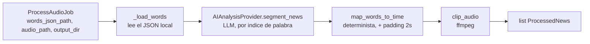

# ORCHESTRATOR_DESIGN.md

## Objetivo

`MediaProcessingOrchestrator` es el primer componente de la capa de Aplicación del PRD (`API → Application → Domain ← Infrastructure`, ver [PRD.md](PRD.md#estilo-arquitectónico)). Su única responsabilidad es **coordinar** los módulos de IA ya validados, en el orden correcto — no contiene lógica de segmentación, mapeo ni clipping propia.

**No hace:**
- Segmentación de noticias (eso es `AIAnalysisProvider`).
- Mapeo de palabras a tiempo (eso es `map_words_to_time`).
- Corte de audio (eso es `clip_audio`).
- Subir el clip a almacenamiento durable (eso es `ClipStorage`, ver más abajo — vive en `PipelineRunService`/la capa API, no en el orquestador).
- Nada de: S3, PostgreSQL, cola SQS, matching de cliente, sentimiento, automatización. Todo eso queda fuera de esta fase a propósito.

**Sí hace:** recibe un trabajo con rutas a archivos locales, llama a los tres pasos en orden, y devuelve la lista de noticias procesadas en memoria — **ya con** resumen, keywords, categoría y entidades extraídas por el LLM (ver "Salida del LLM" más abajo; eso sí cambió desde la primera versión de este documento, que asumía solo título+rango+confianza).

## Ubicación

`src/application/orchestrator.py`

## Pipeline



1. **Recibir un trabajo** — `ProcessAudioJob(words_json_path, audio_path, output_dir, padding_seconds=2.0)`. Todo son rutas locales; no hay lookup por `station`/S3 todavía — eso se agrega cuando se integre S3 (ver Roadmap del PRD, Fase 2).
2. **Localizar el `words.json`** — se lee y parsea directamente desde `job.words_json_path` (mismo formato que produce chepita, ver [INFRASTRUCTURE.md](INFRASTRUCTURE.md)).
3. **`AIAnalysisProvider.segment_news(words)`** — puerto abstracto; hoy resuelto por `OpenAIAnalysisProvider`, intercambiable sin tocar el orquestador (FR-041).
4. **`map_words_to_time(segment, words, padding)`** por cada noticia propuesta — determinista, sin LLM.
5. **`clip_audio(audio_path, output_path, start_time, end_time)`** por cada noticia — corte exacto vía ffmpeg.
6. **Devolver** `list[ProcessedNews]`, cada uno con el `NewsSegment` original, `start_time`/`end_time` finales (con padding aplicado) y el `ClipResult` (ruta del clip generado).

## Contrato

```python
@dataclass
class ProcessAudioJob:
    words_json_path: Path
    audio_path: Path
    output_dir: Path
    padding_seconds: float = 2.0

@dataclass
class ProcessedNews:
    segment: NewsSegment
    start_time: float
    end_time: float
    clip: ClipResult
    text: str   # transcripcion completa del rango de la noticia (join de words) -- agregado para llenar NoticiaVersion.transcripcion_texto

class MediaProcessingOrchestrator:
    def __init__(self, ai_provider: AIAnalysisProvider): ...
    def process_audio(self, job: ProcessAudioJob) -> list[ProcessedNews]: ...
```

`ai_provider` se inyecta por constructor (no se instancia dentro del orquestador) — así el orquestador nunca sabe qué proveedor es. En la práctica hoy es siempre `AnthropicAnalysisProvider` (ver más abajo, "Sin fallback a otro modelo").

## Salida del LLM — `NewsSegment` (ampliado)

El schema original solo traía `title`/`start_word`/`end_word`/`confidence`. Se amplió para llenar de una vez lo que antes quedaba vacío a propósito en `NoticiaVersion` (ver `docs/BACKEND_ARCHITECTURE.md`):

```python
class NewsType(str, enum.Enum):
    POLITICA = "politica"
    ECONOMIA = "economia"
    DEPORTES = "deportes"
    SALUD = "salud"
    SEGURIDAD = "seguridad"
    SOCIEDAD = "sociedad"
    INTERNACIONAL = "internacional"
    TECNOLOGIA = "tecnologia"
    ENTRETENIMIENTO = "entretenimiento"
    OTRO = "otro"

class NewsSegment(BaseModel):
    title: str
    start_word: int
    end_word: int
    summary: str                 # maximo 2 oraciones
    keywords: list[str]          # 5-10, instruccion de prompt + truncado en Python (no en el JSON schema, ver nota abajo)
    news_type: NewsType           # enum cerrado -- evita "Politica"/"politica"/"Politico"
    people: list[str]            # menciones crudas, sin resolver contra Entidad
    organizations: list[str]
    locations: list[str]
    confidence: float
```

**Deliberadamente NO incluye** programa/periodista/emisora/fecha/hora — el LLM solo ve texto por índice de palabra, nunca sabe de qué `Grabacion` viene el chunk, así que ni siquiera podría inferirlos; el prompt lo prohíbe explícitamente de todas formas.

**`people`/`organizations`/`locations` son menciones crudas**, no resueltas contra el catálogo `Entidad` (`src/modules/ai/models.py`) — esa deduplicación (¿"JOH" y "Juan Orlando Hernandez" son la misma persona?) queda para una fase posterior. Hoy se guardan tal cual en `NoticiaVersion.metadatos_ia` (JSONB), junto con `news_type` y `keywords`.

**Por qué el matching cliente↔noticia no vive aquí:** es una relación N:M contra `MonitoringProfile` de cada tenant, cambia cada vez que se agrega un cliente nuevo, y debería ser un `SELECT` determinista sobre las entidades ya extraídas — no una inferencia del LLM que habría que re-correr (con costo de tokens) cada vez que cambia la lista de clientes.

## Sin fallback a otro modelo (decisión explícita)

`AIProviderWithFallback` (secundario a OpenAI, luego a Haiku) se probó y se **revirtió** — ver `src/api/deps.py`. Hoy `get_pipeline_run_service()` inyecta `AnthropicAnalysisProvider` directo, sin wrapper de fallback. Razón: la precisión de nombres/entidades (que alimenta el matching de cliente) importa más que la disponibilidad — se prefiere que el `PipelineRun` quede en `ERROR` (después de los 3 reintentos ya existentes en `AnthropicAnalysisProvider`) a degradar silenciosamente la calidad cayendo a un modelo más chico. Un A/B real (Sonnet vs Haiku 4.5, mismo audio, mismos 6 grabaciones) mostró que Haiku garabatea nombres propios (`"Henry Antonio Valladar"` en vez de `"Henry Antonio Valladares"`) y comprime la calibración de `confidence` hacia arriba — ambos problemas reales para este producto específico.

## Rendimiento — paralelización + prompt caching

`AnthropicAnalysisProvider.segment_news()` llamaba a Claude **secuencialmente**, un chunk de 600 palabras a la vez (~13 llamadas para una hora de audio) — el cuello de botella dominante en el tiempo de pared por grabación. Dos cambios, ninguno arquitectónico:

- **Paralelización**: los chunks son independientes entre sí, así que ahora corren por un `ThreadPoolExecutor` (`max_concurrency=5`, configurable) en vez de un `for` secuencial.
- **Prompt caching**: el `system` prompt y el schema de la tool (`RESPONSE_SCHEMA`) son idénticos en cada llamada — se marcan con `cache_control: {"type": "ephemeral"}` para que Claude se salte el reprocesamiento de esa parte. Anthropic reporta hasta 85% menos latencia y ~90% menos costo en la porción cacheada.

Para backfills masivos (reprocesar meses de historial) la [Batch API de Anthropic](https://platform.claude.com/docs/en/build-with-claude/batch-processing) (50% de descuento, asíncrona, hasta 10k requests por batch) es la solución correcta — no implementada todavía, evaluar cuando haga falta reprocesar un volumen grande sin apuro de tiempo real.

## Independencia de los módulos

Cada paso sigue siendo usable por separado, con o sin el orquestador:

| Paso | Módulo | Reusable de forma independiente |
|---|---|---|
| Segmentación | `src/modules/ai/providers/anthropic_provider.py` (implementa `AIAnalysisProvider`) | Sí — cualquier código puede llamar `segment_news(words)` directo |
| Mapeo | `src/modules/ai/mapping.py` | Sí — función pura, sin estado |
| Clipping | `src/modules/ai/clipping.py` | Sí — solo necesita rutas + tiempos |
| Subida de clip | `src/modules/pipeline/resolvers.py` (`ClipStorage`/`S3ClipStorage`) | Sí — puerto separado, `PipelineRunService` lo invoca después del orquestador, no dentro de él |

El orquestador no agrega ningún comportamiento nuevo, solo encadena las tres llamadas de segmentación/mapeo/clipping y propaga los datos de una a la siguiente. La subida a S3 y la limpieza del audio temporal quedan fuera del orquestador a propósito (ver `docs/BACKEND_ARCHITECTURE.md`).

## Pruebas end-to-end

`tests/test_orchestrator_e2e.py` — corre el pipeline completo con archivos locales:
- `tests/fixtures/sample_words.json`: transcript sintético de prueba (149 palabras, jingle + 2 noticias reales + relleno publicitario) ya usado para validar la segmentación en sesiones anteriores.
- Audio de prueba: un tono generado con ffmpeg en `tmp_path` (misma duración que el transcript) — no es audio real, solo valida la mecánica de corte (duración exacta, padding aplicado), no la calidad de transcripción.
- Llama a **OpenAI real** (`OpenAIAnalysisProvider`) y a **ffmpeg real** — es una prueba de integración, no unitaria. Se salta automáticamente (`pytest.mark.skipif`) si no hay `OPENAI_API_KEY` configurada o si `ffmpeg` no está instalado, para no romper CI ni a otros desarrolladores sin esos requisitos.
- Verifica: exactamente 2 noticias detectadas, cada clip existe en disco, y su duración real (medida con `ffprobe`) coincide con `end_time - start_time` esperado (tolerancia 0.1s).

Ejecutada en esta sesión: **1 passed**.

```
tests/test_orchestrator_e2e.py::test_process_audio_end_to_end PASSED
```

## Almacenamiento real — implementado

Tal como se anticipaba, la integración con S3 no tocó el orquestador: `S3RecordingResolver` (descarga audio + arma `words.json` desde `Transcripcion.segmentos`) y `S3ClipStorage` (sube el clip resultante a `media-intel-clips-050871635829`) viven en `src/modules/pipeline/resolvers.py`, invocados desde la capa API (`src/api/routers/pipeline.py`), no desde `MediaProcessingOrchestrator`. El resolver también limpia el directorio temporal (`RecordingResolver.cleanup()`) después de cada corrida, éxito o fallo — sin eso el disco del backend se llena solo (visto en producción: un batch de 208 grabaciones agotó los 6.8GB de una instancia en ~60 grabaciones antes de agregar la limpieza).
