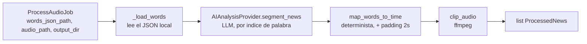

# ORCHESTRATOR_DESIGN.md

## Objetivo

`MediaProcessingOrchestrator` es el primer componente de la capa de Aplicación del PRD (`API → Application → Domain ← Infrastructure`, ver [PRD.md](PRD.md#estilo-arquitectónico)). Su única responsabilidad es **coordinar** los módulos de IA ya validados, en el orden correcto — no contiene lógica de segmentación, mapeo ni clipping propia.

**No hace:**
- Segmentación de noticias (eso es `AIAnalysisProvider`).
- Mapeo de palabras a tiempo (eso es `map_words_to_time`).
- Corte de audio (eso es `clip_audio`).
- Nada de: S3, PostgreSQL, cola SQS, Editorial, matching de cliente, resúmenes, entidades, sentimiento, API REST, automatización. Todo eso queda fuera de esta fase a propósito.

**Sí hace:** recibe un trabajo con rutas a archivos locales, llama a los tres pasos en orden, y devuelve la lista de noticias procesadas en memoria.

## Ubicación

`src/application/orchestrator.py`

## Pipeline



1. **Recibir un trabajo** — `ProcessAudioJob(words_json_path, audio_path, output_dir, padding_seconds=2.0)`. Todo son rutas locales; no hay lookup por `station`/S3 todavía — eso se agrega cuando se integre S3 (ver Roadmap del PRD, Fase 2).
2. **Localizar el `words.json`** — se lee y parsea directamente desde `job.words_json_path` (mismo formato que produce chepita, ver [INFRASTRUCTURE.md](INFRASTRUCTURE.md)).
3. **`AIAnalysisProvider.segment_news(words)`** — puerto abstracto; hoy resuelto por `OpenAIAnalysisProvider`, intercambiable sin tocar el orquestador (FR-041).
4. **`map_words_to_time(segment, words, padding)`** por cada noticia propuesta — determinista, sin LLM.
5. **`clip_audio(audio_path, output_path, start_time, end_time)`** por cada noticia — corte exacto vía ffmpeg.
6. **Devolver** `list[ProcessedNews]`, cada uno con el `NewsSegment` original, `start_time`/`end_time` finales (con padding aplicado) y el `ClipResult` (ruta del clip generado).

## Contrato

```python
@dataclass
class ProcessAudioJob:
    words_json_path: Path
    audio_path: Path
    output_dir: Path
    padding_seconds: float = 2.0

@dataclass
class ProcessedNews:
    segment: NewsSegment
    start_time: float
    end_time: float
    clip: ClipResult

class MediaProcessingOrchestrator:
    def __init__(self, ai_provider: AIAnalysisProvider): ...
    def process_audio(self, job: ProcessAudioJob) -> list[ProcessedNews]: ...
```

`ai_provider` se inyecta por constructor (no se instancia dentro del orquestador) — así el orquestador nunca sabe si el proveedor es OpenAI, Claude, o un mock de test.

## Independencia de los módulos

Cada paso sigue siendo usable por separado, con o sin el orquestador:

| Paso | Módulo | Reusable de forma independiente |
|---|---|---|
| Segmentación | `src/modules/ai/providers/openai_provider.py` (implementa `AIAnalysisProvider`) | Sí — cualquier código puede llamar `segment_news(words)` directo |
| Mapeo | `src/modules/ai/mapping.py` | Sí — función pura, sin estado |
| Clipping | `src/modules/ai/clipping.py` | Sí — solo necesita rutas + tiempos |

El orquestador no agrega ningún comportamiento nuevo, solo encadena estas tres llamadas y propaga los datos de una a la siguiente.

## Pruebas end-to-end

`tests/test_orchestrator_e2e.py` — corre el pipeline completo con archivos locales:
- `tests/fixtures/sample_words.json`: transcript sintético de prueba (149 palabras, jingle + 2 noticias reales + relleno publicitario) ya usado para validar la segmentación en sesiones anteriores.
- Audio de prueba: un tono generado con ffmpeg en `tmp_path` (misma duración que el transcript) — no es audio real, solo valida la mecánica de corte (duración exacta, padding aplicado), no la calidad de transcripción.
- Llama a **OpenAI real** (`OpenAIAnalysisProvider`) y a **ffmpeg real** — es una prueba de integración, no unitaria. Se salta automáticamente (`pytest.mark.skipif`) si no hay `OPENAI_API_KEY` configurada o si `ffmpeg` no está instalado, para no romper CI ni a otros desarrolladores sin esos requisitos.
- Verifica: exactamente 2 noticias detectadas, cada clip existe en disco, y su duración real (medida con `ffprobe`) coincide con `end_time - start_time` esperado (tolerancia 0.1s).

Ejecutada en esta sesión: **1 passed**.

```
tests/test_orchestrator_e2e.py::test_process_audio_end_to_end PASSED
```

## Siguiente paso (no implementado todavía)

Cuando se integre almacenamiento real, el único cambio esperado es **cómo se construye el `ProcessAudioJob`** (descargar `words.json`/audio de S3 a un directorio temporal antes de llamar a `process_audio`, y subir los clips resultantes después) — el orquestador y los tres módulos que coordina no deberían necesitar cambios.
