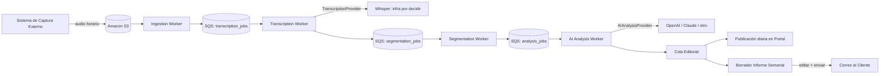
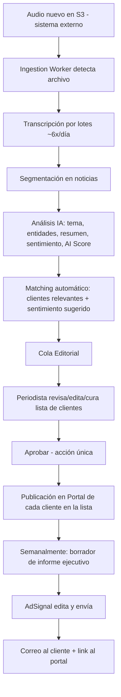
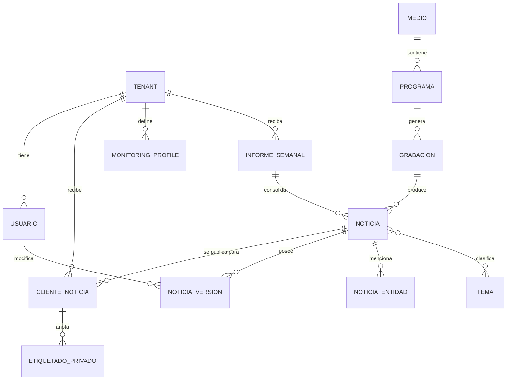

# Product Requirements Document

# Plataforma de Inteligencia Mediática Asistida por IA (MVP)

**Versión:** 2.0 (Validado por entrevista con Product Owner)
**Estado:** Listo para desarrollo
**Reemplaza:** Borradores v1.0 (Capítulos 1-5), DECISIONS_LOG.md, ARCHITECTURE.md v1.0 — este documento es la fuente de verdad única de producto. ARCHITECTURE.md se mantiene como documento técnico de detalle, subordinado a las decisiones de este PRD.

------------------------------------------------------------------------

## Resumen Ejecutivo

AdSignal va a construir una plataforma interna de inteligencia mediática asistida por IA para automatizar el monitoreo, análisis, validación editorial y distribución de noticias de radio y televisión (audio) en Honduras.

El audio ya se captura hoy mediante un sistema externo existente (13 medios entre radio y TV, grabación horaria a Amazon S3) que **no forma parte de este proyecto** — esta plataforma consume ese audio, no lo captura.

El pipeline de IA transcribe el audio (Whisper, en lotes ~6 veces al día) y luego usa un modelo de lenguaje (proveedor intercambiable: OpenAI, Claude/Anthropic, u otro) para segmentar el audio en noticias individuales, clasificarlas, extraer entidades, generar resumen/título, calcular sentimiento y **pre-sugerir a qué cliente(s) le corresponde cada noticia**. Un periodista humano revisa, corrige y aprueba cada noticia antes de que sea visible para los clientes — la IA nunca publica directamente.

Las noticias aprobadas se publican día a día en el Portal del Cliente. Además, semanalmente, AdSignal genera, edita y envía manualmente (desde la plataforma) un informe ejecutivo por correo a cada cliente, con un link al detalle completo en el portal.

**Criterios de éxito del MVP:**

- Procesar audio de las estaciones ya monitoreadas, existente en S3.
- Generar noticias estructuradas automáticamente con sugerencia de cliente(s) relevante(s).
- Permitir validación editorial completa desde una única interfaz.
- Publicar noticias aprobadas en el portal del cliente, a diario.
- Generar, editar y enviar un informe ejecutivo semanal por cliente.
- Mantener historial completo y auditable, incluso tras publicar.

------------------------------------------------------------------------

## Problema

Actualmente el monitoreo de medios depende en gran medida de trabajo manual.

- Imposibilidad de monitorear todos los medios relevantes del país manualmente.
- Alto costo operativo.
- Procesos lentos para revisar, clasificar y resumir noticias.
- Dificultad para mantener un histórico estructurado.
- Riesgo de inconsistencias entre analistas.

------------------------------------------------------------------------

## Objetivos

### Objetivo General

Construir una plataforma editorial asistida por IA que reduzca el trabajo manual, mejore la velocidad de producción y permita ofrecer un servicio de monitoreo de medios escalable, comenzando con 2-3 clientes piloto.

### Objetivos Específicos

- Automatizar transcripción, segmentación, clasificación y sugerencia de relevancia por cliente.
- Mantener una única base de conocimiento (una noticia existe una sola vez).
- Facilitar una validación editorial rápida (2 periodistas deben poder cubrir el volumen diario).
- Publicar información personalizada y filtrable para cada cliente.
- Entregar un informe ejecutivo semanal curado por AdSignal.
- Crear un archivo histórico reutilizable e indefinido.

------------------------------------------------------------------------

## Visión

Convertirse en la principal plataforma de inteligencia mediática de Honduras, capaz de transformar grandes volúmenes de contenido de radio y TV en conocimiento útil mediante IA y validación editorial, con una arquitectura que pueda evolucionar hacia más fuentes (prensa digital, redes sociales) sin rediseño del núcleo.

------------------------------------------------------------------------

## Alcance

### Incluye (MVP)

- Consumo de audio ya capturado por el sistema externo existente (13 medios, radio + TV, subida horaria a S3).
- Transcripción automática por lotes (~6 veces al día).
- Segmentación automática en noticias individuales.
- Clasificación temática (tema/subtema).
- Extracción de entidades (personas, instituciones, empresas, lugares).
- Resumen y título generados por IA.
- Sentimiento general y sentimiento específico por cliente.
- **Sugerencia automática de cliente(s) relevante(s) por noticia** (Monitoring Profiles + matching por IA).
- Centro Editorial: cola de trabajo, edición total (metadata, clientes, sentimiento), aprobación en una sola acción.
- Edición de noticias **después** de publicadas, con indicador visible de "editado" para el cliente.
- Portal del Cliente: consulta diaria de noticias aprobadas, búsqueda con filtros, escucha de audio, transcripción, descarga de evidencia.
- Etiquetado privado del cliente (subcategoría/keywords propias, sin generar feedback a AdSignal).
- Informe ejecutivo semanal: generado en borrador por IA, editado y enviado manualmente desde la plataforma, por correo (resumen + link al portal).
- Búsqueda histórica.
- Modelo multi-tenant: AdSignal como Super Admin de plataforma, cada cliente con su propio Admin de tenant.

### Fuera del alcance (MVP)

- Redes sociales, prensa digital, podcasts.
- Captura de medios (es un sistema externo ya existente, no se construye aquí).
- OCR de video / análisis de video (solo audio, incluso para TV).
- APIs públicas e integraciones con terceros.
- Monitoreo en tiempo real.
- NOC (Centro de Operaciones) operativo.
- Notificaciones automáticas de cualquier tipo (no hay alertas push, ni avisos al aprobar/publicar una noticia individual). El único envío al cliente es el informe ejecutivo semanal, manual.
- Reporte diario como documento (sí hay publicación diaria en el portal, pero no un "reporte" formal por día).
- **"Cases" / agrupación manual de noticias en expedientes — evaluado y descartado explícitamente, no se construye.**
- SSO (Google/Microsoft) y MFA — autenticación es solo usuario/contraseña + JWT en el MVP.
- Facturación (gestión de cobros fuera del sistema).
- Reconocimiento de periodistas por voz.

------------------------------------------------------------------------

## Usuarios

| Rol | Alcance | Responsabilidad |
|---|---|---|
| **Super Admin (AdSignal)** | Plataforma completa, todos los tenants | Configura clientes/tenants, medios, usuarios internos, parámetros globales. Es el "Administrador" de más alto nivel. |
| **Supervisor Editorial** | Interno AdSignal, cross-tenant | Controla calidad, audita el desempeño del equipo editorial. |
| **Periodista / Editor** | Interno AdSignal, cross-tenant | Toma noticias de la cola, escucha, corrige, ajusta clip, edita clientes relevantes y sentimiento por cliente, aprueba/rechaza, edita el borrador del informe semanal. |
| **Administrador del Cliente** | Un solo tenant | Administra usuarios de su propia organización, configura su Monitoring Profile (personas de interés, instituciones, temas, medios). |
| **Usuario del Cliente** | Un solo tenant | Consulta noticias, busca, escucha evidencia, descarga, etiqueta privadamente. |

------------------------------------------------------------------------

## Personas

**Director de Comunicación** — Necesita conocer diariamente qué dicen los medios sobre su organización, sin depender solo del informe semanal.

**Periodista Editor de AdSignal** — Revisa 2-3 clientes de contenido posiblemente extenso por día; necesita que la IA acierte lo suficiente en la pre-sugerencia de clientes/metadata para que su trabajo sea de corrección, no de creación desde cero.

**Supervisor Editorial** — Garantiza calidad y realiza auditorías internas sobre el trabajo de los periodistas.

**Ejecutivo Institucional (cliente)** — Recibe el informe ejecutivo semanal por correo y usa el link para profundizar en el portal cuando lo necesita.

------------------------------------------------------------------------

## Casos de uso

| Actor | Necesidad | Cómo lo hace hoy | Qué espera del sistema |
|---|---|---|---|
| Periodista | Revisar la noticia más antigua pendiente | Trabajo manual, sin herramienta | Cola FIFO simple, con metadata y clientes ya pre-sugeridos por IA para solo corregir/aprobar |
| Periodista | Corregir un dato mal generado por la IA (transcripción, entidad, cliente, keyword) | N/A | Edición libre de todos los campos, sin restricciones |
| Periodista | Corregir una noticia ya publicada | N/A | Debe poder editar post-publicación; el cliente ve un timestamp discreto de "editado" |
| Periodista/AdSignal | Armar y enviar el informe semanal | Manual, probablemente en Word/Excel | Borrador generado por IA, editable (texto y lista de noticias), botón "Enviar" desde la plataforma |
| Admin del Cliente | Definir qué le interesa monitorear | N/A | Configurar Monitoring Profile (personas, instituciones, temas, medios) que alimenta el matching automático |
| Usuario del Cliente | Consultar y filtrar sus noticias | N/A | Portal con filtros por fecha/medio/programa/tema/persona/sentimiento |
| Usuario del Cliente | Organizar noticias a su manera | N/A | Etiquetado privado (subcategoría/keywords) sin enviar nada a AdSignal |
| Super Admin (AdSignal) | Dar de alta un nuevo cliente/tenant | N/A | Crear tenant, admin del cliente, configuración inicial |

------------------------------------------------------------------------

## Requisitos funcionales

### Gestión de Usuarios

| ID | Requisito |
|---|---|
| FR-001 | Autenticación mediante usuario y contraseña, con JWT (access + refresh token). **SSO (Google/Microsoft) queda fuera del MVP.** |
| FR-003 | Roles: Super Admin (AdSignal), Supervisor Editorial, Periodista, Administrador del Cliente, Usuario del Cliente. |
| FR-004 | RBAC: cada función protegida por permisos según el rol. |

### Gestión de Clientes (Tenants)

| ID | Requisito |
|---|---|
| FR-010 | Crear cliente/tenant: organización, contactos, configuración, Admin del Cliente inicial. |
| FR-011 | **Monitoring Profile por cliente:** personas de interés, instituciones, temas, medios monitoreados, destinatarios del informe semanal. Alimenta el matching automático de IA. |
| FR-012 | Relación Cliente-Noticia con: relevancia, sentimiento específico, estado de publicación, etiquetado privado del cliente. |

### Gestión de Medios

| ID | Requisito |
|---|---|
| FR-020 | Registrar medios (radio y televisión) monitoreados por el sistema de captura externo. |
| FR-021 | Cada medio tiene múltiples programas. |
| FR-022 | Registrar grabaciones (referencia a objetos en S3, generados por el sistema de captura externo — no se suben desde esta plataforma). |

### Pipeline IA

| ID | Requisito |
|---|---|
| FR-030 | Ingesta: leer archivos de audio nuevos desde el bucket S3 del sistema de captura externo, en lotes programados (~6 veces/día). |
| FR-031 | Transcripción automática vía proveedor intercambiable (`TranscriptionProvider`: Whisper self-hosted, servidor externo, o API tipo OpenAI Whisper — **infraestructura aún no decidida**, ver Preguntas Abiertas). |
| FR-032 | Segmentación automática del audio transcrito en noticias individuales. |
| FR-033 | Clasificación: tema y subtema. |
| FR-034 | Extracción de entidades: personas, instituciones, empresas, lugares. |
| FR-035 | Resumen ejecutivo generado por IA. |
| FR-036 | Propuesta de título. |
| FR-037 | Sentimiento general. |
| FR-038 | Confianza por campo generado (informativa, visible en pantalla editorial; no bloquea ni prioriza — mismo tratamiento que AI Score, ver FR-039). |
| FR-039 | **AI Score (0-100) + prioridad derivada (Crítica/Alta/Media/Baja)** — dato de referencia visible para el periodista. **No reordena la cola editorial (que sigue siendo FIFO) ni descarta noticias automáticamente.** |
| FR-040 | **Matching automático cliente-noticia:** la IA compara cada noticia contra el Monitoring Profile de cada cliente y pre-asigna la lista de clientes relevantes + sentimiento sugerido por cliente, para revisión del periodista. |
| FR-041 | El análisis semántico (FR-032 a FR-040) se ejecuta vía un proveedor de LLM intercambiable (`AIAnalysisProvider`), sin atarse a un solo vendor (OpenAI, Claude/Anthropic, u otro). |

### Centro Editorial

| ID | Requisito |
|---|---|
| FR-050 | Cola de trabajo FIFO: el periodista toma la siguiente noticia pendiente por orden de llegada. |
| FR-051 | Bloqueo: mientras un periodista edita, la noticia queda bloqueada para otros periodistas. |
| FR-052 | Reproductor de audio a velocidades 1x, 1.25x, 1.5x, 2x y 3x. |
| FR-053 | Transcripción sincronizada con el audio. |
| FR-054 | Edición libre de: título, resumen, entidades, tema/subtema, ajuste de clip, y **la lista de clientes relevantes propuesta por la IA** (agregar o quitar clientes). |
| FR-055 | Edición de sentimiento por cada cliente en la lista curada. |
| FR-056 | **Aprobar/Rechazar es una sola acción por noticia** (no una acción separada por cada cliente). Al aprobar, la noticia se publica para todos los clientes que quedaron en la lista curada por el periodista. |
| FR-057 | Edición de noticias **ya publicadas**: el periodista puede corregir cualquier campo, incluida la lista de clientes, después de la publicación. |
| FR-058 | Toda noticia editada tras su publicación muestra al cliente un indicador discreto ("editado a las [hora]") — no intrusivo. |

### Noticias (Base de Conocimiento)

| ID | Requisito |
|---|---|
| FR-070 | Noticia única: existe una sola vez en la base de conocimiento, independientemente de a cuántos clientes le corresponda. |
| FR-071 | Versionado: toda modificación (incluso post-publicación) genera una nueva versión; nunca se sobrescribe. |
| FR-072 | Auditoría: usuario, fecha, hora, valor anterior y nuevo por cada cambio. |

### Portal del Cliente

| ID | Requisito |
|---|---|
| FR-080 | Dashboard con noticias del cliente, actualizado a diario a medida que se aprueban. |
| FR-081 | Buscar noticias con filtros: fecha, medio, programa, tema, subtema, persona, institución, sentimiento. |
| FR-082 | Escuchar evidencia de audio. |
| FR-083 | Leer transcripción. |
| FR-084 | Descargar evidencia. |
| FR-085 | **Etiquetado privado del cliente:** el usuario del cliente puede agregar subcategorías o keywords propias a una noticia, visibles solo para su organización. No genera ningún aviso ni ticket hacia AdSignal. |

### Informe Ejecutivo Semanal

| ID | Requisito |
|---|---|
| FR-090 | El sistema genera automáticamente un borrador semanal por cliente (resumen ejecutivo + listado consolidado de noticias aprobadas de la semana). |
| FR-091 | El periodista/AdSignal edita el borrador dentro de la plataforma: texto del resumen y/o la lista de noticias incluidas. |
| FR-092 | Al presionar "Enviar", el sistema manda un correo al/los destinatario(s) configurado(s) del cliente (FR-011), con el resumen ejecutivo y un link al detalle completo en el portal. Formato exacto del cuerpo (HTML/PDF adjunto/Word) **pendiente de definir** (ver Preguntas Abiertas). |
| FR-093 | Queda registro de quién envió el informe y cuándo (auditoría). |
| FR-094 | No hay reporte diario como documento — solo la publicación diaria de noticias individuales en el portal (FR-080). |

### Administración

| ID | Requisito |
|---|---|
| FR-100 | Catálogos maestros: personas, instituciones, empresas, municipios, departamentos, temas, subtemas. |
| FR-101 | Administración de usuarios (por tenant y a nivel plataforma). |
| FR-102 | Administración de clientes/tenants (Super Admin). |
| FR-103 | Administración de medios y programas (Super Admin). |

------------------------------------------------------------------------

## Requisitos no funcionales

### Rendimiento

| ID | Requisito |
|---|---|
| NFR-001 | Procesamiento por lotes: la transcripción corre en lotes programados (~6 veces/día), no en tiempo real. |
| NFR-002 | Reanudación: procesos interrumpidos deben poder reanudarse sin reprocesar audio ya transcrito. |
| NFR-003 | Paralelismo: múltiples trabajos de IA (transcripción, segmentación, análisis) deben poder ejecutarse en paralelo vía colas. |

### Disponibilidad

| ID | Requisito |
|---|---|
| NFR-010 | No se requiere alta disponibilidad (HA) para el MVP. |
| NFR-011 | Las caídas del sistema no deben provocar pérdida de información (jobs reencolables). |
| NFR-012 | Todas las tareas asíncronas quedan registradas con `job_id` único para trazabilidad y recuperación. |

### Seguridad

| ID | Requisito |
|---|---|
| NFR-020 | Autenticación: usuario/contraseña + JWT (access + refresh token). **Sin SSO ni MFA en el MVP** — decisión explícita para mantener el MVP simple. |
| NFR-021 | RBAC con permisos independientes por rol (ver sección Usuarios). |
| NFR-022 | Registrar IP y user-agent en cada login, para dejar la puerta abierta a MFA/SSO futuro sin rediseño, si algún cliente institucional lo exige. |

### Auditoría

Toda acción importante se registra: usuario, fecha, hora, acción, valor anterior, valor nuevo (FR-072). Las noticias mantienen historial completo de versiones, incluso tras publicarse.

### Escalabilidad

| ID | Requisito |
|---|---|
| NFR-030 | Modelo multi-tenant de **schema compartido** con `tenant_id` en tablas de negocio (no schema-per-tenant, no DB-per-tenant). |
| NFR-031 | Los workers de IA (transcripción, análisis) deben poder escalar independientemente del backend/frontend vía colas (SQS). |
| NFR-032 | El equipo editorial debe poder crecer (más periodistas) sin cambios de arquitectura si el volumen de noticias lo requiere. |

### Almacenamiento

Las grabaciones originales (propiedad del sistema de captura externo) y las noticias/transcripciones generadas se conservan indefinidamente. Las noticias son reprocesables con futuros modelos de IA sin perder el histórico.

### Base de Datos

PostgreSQL con integridad referencial, versionado, auditoría, transacciones, índices para búsqueda histórica, y `pgvector` habilitado para búsqueda semántica futura.

### Observabilidad

Logs estructurados en JSON, manejo global de excepciones, endpoint `/health`. Sin Grafana/Prometheus en el MVP.

### Compatibilidad

Navegadores modernos (Chrome, Edge, Firefox, Safari reciente). Diseño responsive para escritorio y tablet.

------------------------------------------------------------------------

## Arquitectura funcional

Cinco dominios funcionales desacoplados:

1. **Captura de Medios** — Externo, ya existente, fuera de este proyecto.
2. **Plataforma de Procesamiento IA** (MVP)
3. **Centro Editorial** (MVP)
4. **Portal del Cliente** (MVP)
5. **Centro de Operaciones (NOC)** — Futuro.

### Estilo arquitectónico

- **Modular Monolith**: cada capacidad de negocio (auth, clientes, medios, grabaciones, transcripción, IA, editorial, reportes, notificaciones) aislada en su propio módulo, dentro de un único deploy.
- **Hexagonal Architecture (Ports & Adapters)** + principios de Clean Architecture: las reglas de negocio nunca dependen de infraestructura; las dependencias siempre apuntan hacia adentro (API → Application → Domain ← Infrastructure).

Esto da bajo costo operativo y desarrollo rápido para el MVP, con camino claro a microservicios si el volumen lo justifica más adelante.

------------------------------------------------------------------------

## Módulos

| Módulo | Responsabilidad |
|---|---|
| Auth | Login, JWT, RBAC |
| Clients (Tenants) | Alta de clientes, Monitoring Profiles, usuarios del cliente |
| Media | Medios y programas monitoreados (referencia al sistema externo) |
| Recordings | Referencia a grabaciones en S3 |
| Transcription | Orquestación vía `TranscriptionProvider` |
| AI | Segmentación, clasificación, entidades, resumen, sentimiento, AI Score, matching cliente vía `AIAnalysisProvider` |
| Editorial | Cola de trabajo, edición, aprobación, versionado |
| Reports | Generación de borrador semanal, edición, envío |
| Notifications | Reservado — sin uso activo en el MVP (solo infraestructura de correo para el envío del informe) |

------------------------------------------------------------------------

## Flujos del sistema

### Flujo general

### Flujo editorial

1. La IA transcribe, segmenta, clasifica y pre-sugiere clientes + sentimiento por cliente.
2. La noticia entra a la cola FIFO.
3. Un periodista toma la siguiente noticia.
4. Escucha el audio, revisa la transcripción sincronizada.
5. Corrige cualquier campo: título, resumen, entidades, tema/subtema, clip.
6. Cura la lista de clientes propuesta (agrega/quita) y ajusta sentimiento por cliente.
7. Aprueba (una sola acción) o rechaza.
8. Al aprobar, se publica automáticamente para todos los clientes que quedaron en la lista.
9. Si después se detecta un error, el periodista puede editar la noticia ya publicada; el cliente ve un timestamp discreto de "editado".

### Flujo del informe semanal

1. El sistema genera un borrador con resumen ejecutivo + listado de noticias aprobadas de la semana, por cliente.
2. AdSignal (periodista/supervisor) edita el texto y/o la lista de noticias dentro de la plataforma.
3. Al presionar "Enviar", el sistema manda el correo (resumen + link al portal) y registra el envío.

------------------------------------------------------------------------

## Reglas de negocio

| ID | Regla |
|---|---|
| RN-001 | La IA nunca publica directamente. |
| RN-002 | El periodista valida antes de publicar. |
| RN-003 | Toda noticia mantiene historial de versiones, incluso después de publicada. |
| RN-004 | Las grabaciones originales nunca se eliminan. |
| RN-005 | El sentimiento general puede diferir del sentimiento específico para un cliente. |
| RN-006 | Una noticia puede ser relevante para varios clientes a la vez. |
| RN-007 | La aprobación de una noticia es una sola acción; la exclusión de un cliente se logra quitándolo de la lista curada antes de aprobar, no con un estado de aprobación independiente por cliente. |
| RN-008 | El AI Score y la Confianza por campo son solo informativos: no reordenan la cola editorial ni descartan noticias automáticamente. |
| RN-009 | El etiquetado privado del cliente (FR-085) nunca genera un aviso o ticket hacia AdSignal. |
| RN-010 | No existe agrupación de noticias en "casos" o expedientes — cada noticia se gestiona de forma independiente. |

------------------------------------------------------------------------

## Modelo de datos de alto nivel

Notas de diseño confirmadas en la entrevista:

- **Multi-tenant de schema compartido**: `tenant_id` en tablas de negocio, no bases/schemas separados.
- **UUID v7** como llave primaria (ordenable por tiempo, útil para paginación y particionamiento futuro).
- **Sin tabla `Case`/`CaseNews`** — evaluada y descartada.
- `CLIENTE_NOTICIA` guarda: relevancia, sentimiento por cliente, estado de publicación, etiquetado privado.
- `NOTICIA_VERSION` es inmutable — nunca se sobrescribe, ni siquiera post-publicación.

------------------------------------------------------------------------

## Integraciones

- **Ninguna integración de negocio con terceros en el MVP** (CRM, Slack, etc. — fuera de alcance).
- Dependencia de infraestructura: **Amazon S3** (lectura del bucket del sistema de captura externo, ya existente).
- Dependencia de infraestructura: **Servicio SMTP** para el envío del correo del informe semanal.
- Dependencia de infraestructura: **Proveedor de transcripción** (`TranscriptionProvider`, abstracto — infraestructura concreta pendiente de decidir).
- Dependencia de infraestructura: **Proveedor de LLM** (`AIAnalysisProvider`, abstracto — OpenAI, Claude/Anthropic u otro, pendiente de decidir).

------------------------------------------------------------------------

## APIs

- **Sin API pública en el MVP.**
- API interna (FastAPI) consumida únicamente por el frontend Next.js propio — no expuesta a terceros.

------------------------------------------------------------------------

## Seguridad

- JWT (access + refresh token) + RBAC.
- Sin SSO ni MFA en el MVP — decisión deliberada para simplicidad; queda abierta la puerta a agregarlos después (se registra IP/user-agent desde el día uno).
- Multi-tenant con aislamiento lógico por `tenant_id` (no aislamiento físico de datos en el MVP).
- Auditoría completa de cambios y de envíos de informes.

------------------------------------------------------------------------

## Escalabilidad

- Arquitectura de colas (SQS) permite escalar cada worker de forma independiente según volumen.
- Transcripción vía infraestructura elástica (GPU on-demand, se apaga tras cada lote).
- Equipo editorial escalable sin cambios de sistema: arranca con 2 periodistas, puede crecer si el volumen de "muchísimas noticias por día" supera su capacidad de cola FIFO.
- Modular Monolith con límites de módulo claros permite migrar a microservicios más adelante si es necesario, sin rediseño del dominio.

------------------------------------------------------------------------

## Riesgos

| Riesgo | Impacto | Mitigación |
|---|---|---|
| Volumen de noticias supera la capacidad de 2 periodistas (cola FIFO se acumula) | Alto | Equipo editorial escalable a demanda; monitorear tamaño de cola desde el día uno |
| Infraestructura de transcripción aún no decidida (EC2 Spot GPU vs servidor externo vs API) | Medio | `TranscriptionProvider` como interfaz abstracta — decisión no bloquea el desarrollo del resto del sistema |
| Proveedor de LLM semántico aún no decidido | Medio | `AIAnalysisProvider` como interfaz abstracta — mismo tratamiento |
| Baja calidad del audio capturado (fuera de control de este proyecto) | Alto | Validación humana obligatoria antes de publicar |
| Errores de IA en matching cliente-noticia (falsos positivos/negativos) | Alto | Periodista cura la lista de clientes antes de aprobar; Monitoring Profile ajustable por el cliente |
| Crecimiento del almacenamiento histórico | Medio | Retención indefinida ya asumida en el diseño; políticas de ciclo de vida en S3 a futuro |
| Ediciones post-publicación generan desconfianza del cliente | Bajo | Timestamp discreto de "editado", transparente pero no alarmante |

------------------------------------------------------------------------

## KPIs

### Operativos

- Noticias procesadas por día.
- Noticias publicadas por día.
- Tamaño de la cola editorial (para anticipar necesidad de más periodistas).
- Tiempo promedio de revisión editorial por noticia.

### Calidad

- Precisión de transcripción.
- Precisión del matching automático cliente-noticia (correcciones del periodista a la lista sugerida).
- Correcciones realizadas por periodistas por campo.

### Cliente

- Tiempo de entrega del informe semanal.
- Uso del portal (consultas diarias, no solo en la semana del informe).
- Búsquedas realizadas.

------------------------------------------------------------------------

## MVP

### Imprescindible

- Pipeline IA completo (transcripción → segmentación → análisis → matching cliente).
- Centro Editorial funcional (cola, edición, aprobación única, edición post-publicación).
- Portal del Cliente con publicación diaria y búsqueda con filtros.
- Informe semanal: borrador, edición, envío desde la plataforma.
- Auth JWT + RBAC, multi-tenant.
- Auditoría y versionado.

### Importante

- Etiquetado privado del cliente.
- Monitoring Profile configurable por el cliente.
- AI Score / Confianza visibles (aunque no bloqueantes).

### Deseable

- Definición final del formato del informe (HTML/PDF/Word).
- Selección definitiva del proveedor de LLM semántico.

### Futuro (fuera del MVP)

- SSO y MFA.
- Notificaciones/alertas automáticas.
- Redes sociales, prensa digital, podcasts.
- NOC operativo.
- Analítica avanzada, búsqueda semántica con pgvector.

------------------------------------------------------------------------

## Roadmap

### Fase 1 — Fundación
Autenticación JWT, gestión de usuarios/tenants, gestión de medios y programas (referencia al sistema externo).

### Fase 2 — Pipeline IA
Ingesta desde S3, transcripción, segmentación, clasificación, entidades, sentimiento, AI Score, matching cliente-noticia, persistencia versionada.

### Fase 3 — Centro Editorial
Cola de trabajo, editor completo, aprobación única, edición post-publicación, auditoría.

### Fase 4 — Portal del Cliente
Dashboard, búsqueda avanzada, reproductor, descarga de evidencia, etiquetado privado.

### Fase 5 — Informe Semanal
Generación de borrador, edición, envío desde la plataforma, registro de auditoría de envíos.

### Fase 6 — Evolución (post-MVP)
SSO/MFA, notificaciones, redes sociales, prensa digital, podcasts, NOC, analítica avanzada, búsqueda semántica.

------------------------------------------------------------------------

## Glosario

**Noticia:** Unidad editorial única derivada de una grabación; existe una sola vez en la base de conocimiento sin importar a cuántos clientes le corresponda.

**Tenant:** Organización cliente con su propio espacio lógico (schema compartido + `tenant_id`), administrada por su propio Admin de Cliente.

**Monitoring Profile:** Configuración por cliente (personas, instituciones, temas, medios) que alimenta el matching automático de IA para sugerir a qué cliente le corresponde cada noticia.

**AI Score:** Puntaje 0-100 generado por IA con una prioridad derivada (Crítica/Alta/Media/Baja); es solo referencia visual para el periodista, no afecta el orden de la cola.

**Entidad:** Persona, institución, empresa o lugar identificado por la IA.

**Cliente-Noticia:** Relación que almacena relevancia, sentimiento específico, estado de publicación y etiquetado privado para un cliente.

**Etiquetado privado:** Subcategoría o keyword que un cliente agrega a una noticia para su propio consumo, sin generar aviso a AdSignal.

**Centro Editorial:** Interfaz donde los periodistas de AdSignal validan el contenido generado por IA.

**Portal del Cliente:** Plataforma donde los clientes consultan noticias, el histórico y descargan evidencia.

**Informe Ejecutivo Semanal:** Único documento/envío periódico del MVP — no hay reporte diario formal.

------------------------------------------------------------------------

## Preguntas abiertas

Estas decisiones quedaron explícitamente pendientes durante la entrevista — no bloquean el inicio del desarrollo porque la arquitectura las aísla detrás de interfaces (`TranscriptionProvider`, `AIAnalysisProvider`), pero deben resolverse antes de cerrar esos módulos:

1. ~~**Infraestructura de transcripción:**~~ resuelto — EC2 GPU propio ("chepita", `g6.xlarge`/L4, Faster-Whisper), ver `docs/INFRASTRUCTURE.md`.
2. ~~**Proveedor de LLM para el análisis semántico:**~~ resuelto — Claude Sonnet 5 (Anthropic), sin fallback a otro proveedor ni otro modelo (decisión explícita, no solo "todavía no se decidió"; ver `docs/ORCHESTRATOR_DESIGN.md`, sección "Sin fallback a otro modelo"). `AIAnalysisProvider` sigue siendo la interfaz abstracta — `OpenAIAnalysisProvider` existe y sigue probado, pero nada lo instancia en producción hoy.
3. **Formato del informe ejecutivo semanal:** ¿cuerpo del correo en HTML, adjunto en PDF, o adjunto en Word?
4. **Presupuesto y timeline formal del proyecto** — no se cubrió en la entrevista de producto; recomendable definirlo antes de comprometer fechas de entrega.
5. **¿Se requerirá SSO/MFA para algún cliente institucional específico** (por sensibilidad política) antes de lo previsto en la Fase 6? — a vigilar según los primeros 2-3 clientes piloto.
